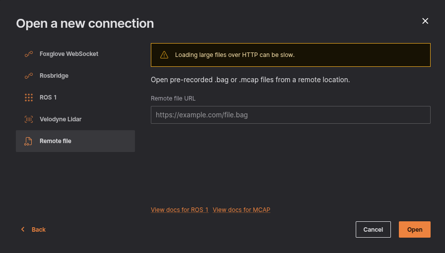

# MCAP

Load local and remote [MCAP files](https://mcap.dev).

## Live Data

In Lichtblick select "Open connection" in the initial pop up or the menu on the top left.

## Remote File

For this option just select the "Remote file" in the "Open connection" option and enter the URL to your remote `.mcap` file.

Its important to note that the "Remote file" option it's only viable to open a single link to a file.

If you intend to open more than one `.mcap` file via URL you'll need to change the URL manually, you can check how to do it on [this page](../multiple-files.md) of our documentation.

## Local Data

You can load local files for visualization by:

- The "Open local file(s)..." in the initial pop up or the menu on the top left;
- You can drag'n drop the files from your OS file manager;

**When dealing with multiple files**, Lichtblick will merge them into a single playback timeline. It's important that they all come from the same data source to avoid potencial data loss or erros during playtime.
