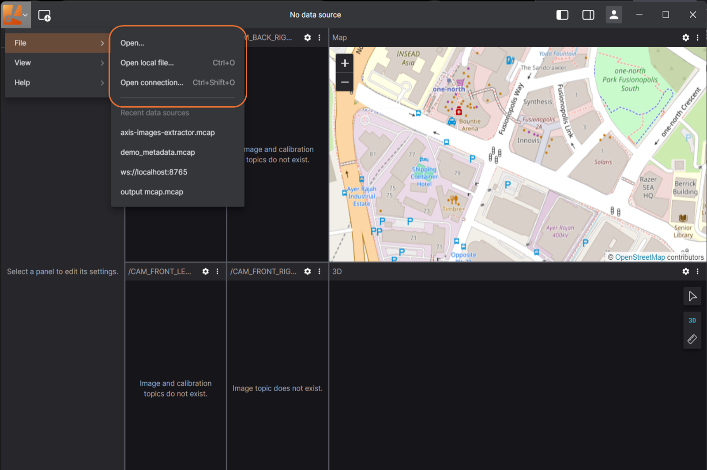

# Local Data

Lichtblick enables you to load local data files for visualization.

## Supported formats

|                                            | File extension |
| ------------------------------------------ | -------------- |
| [ROS1](./frameworks/ros1.md)               | `.bag`         |
| [ROS2](./frameworks/ros2.md) (legacy)      | `.db3`         |
| [ROS2](./frameworks/ros2.md) (Iron onward) | `.mcap`        |
| [MCAP](./frameworks/mcap.md)               | `.mcap`        |
| [PX4 Ulog](./frameworks/px-4.md)           | `.ulg`         |

## Getting started

To visualize local files, follow these steps:

- Click `"Open local file(s)…"` from the dashboard or left-hand menu to browse and select files.
- Open files directly or drag-and-drop them from your OS file manager for quick access.

