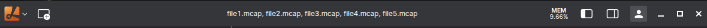

# Multiple files

<div class="warning">
<strong>Note:</strong> Opening multiple files with Lichtblick is <strong>limited to <code>.mcap</code> files only</strong >. Support for aditional file types may be added in future releases.
</div>

Starting with [version 1.10.0](https://github.com/lichtblick-suite/lichtblick/releases/tag/v1.10.0) Lichtblick introduced support for opening multiple files simultaneously, an important feature that enhances the user experience and streamlines the visualization and analyzing process using Lichtblick.

In this section, we'll guide you through how to use this feature, discuss its behavior and share a few tips to get the most out of it.

A Lichtblick session with multiple files opened will look like this:



## How to open multiple files

Just like with single files, Lichtblick allows users to open multiple files, whether they are stored locally or accessed remotely.

### Opening multiple local files

To open local files, as described in our [local data](./local-data.md) documentation, you can either select the files using `"Open local file(s)…"` option or simply drag-and-drop them into Lichtblick.

Alternatively, you can open multiple files before launching the application by using our CLI commands. To learn more about how this works, see [this section of our documentation](../visualization/open-via-cli.md#local-files).

### Opening multiple files from remote sources

To open multiple files from remote sources, you'll need to manually construct the URL that includes references to each file source. Below is an explanation of how Lichtblick handles multiple files via URL

A link that opens multiple files uses two specific query parameters:

- `ds`: Short for _datasource_, this parameter identifies the type of data source. In the case of remote files, it'll always be:

```sh
  ?ds=remote-file
```

- `ds.url`: This parameter contains the actual URL of the remote file to be opened. For example:

```sh
  &ds.url=http://localhost:8081/MCAP_1.mcap
```

To open multiple files you can repeat the `ds.url` parameter for each file, Lichtblick will parse them all and load the correspoding files. So, for instance, an URL that opens three files will look like:

```sh
  http://localhost:8080/?ds=remote-file&ds.url=http://localhost:8081/MCAP_1.mcap&ds.url=http://localhost:8081/MCAP_2.mcap&ds.url=http://localhost:8081/MCAP_3.mcap
```

Don't forget to [set up CORS](../connecting-to-data/live-data.md#cross-origin-resource-sharing-cors-setup) if you intend to host the files yourself.

## Behavior

The current implementation aims to deliver the capability to load multiple `.mcap` files when they originate from the same source file.

When handling multiple files, Lichtblick organizes messages based on their timestamps (`log time`), maintaining chronological order across all files. If any gaps are detected in the timeline, they will be visually reflected in the UI, preserving the integrity of the data stream.

### From the same source origin

When multiple files originate from the same data source, with identical structures (e.g., topics, schemas), Lichtblick will merge them into a single timeline, as if they were one continuous recording.

This is the **most stable and recommended usage** for multiple files in Lichtblick. It works especially well when files are split by time (e.g., consecutive recordings), allowing for seamless chronological playback and analysis.

### From different sources

Lichtblick will attempt to load and render all data, even if the files have different topics, schemas, or structures and it will try to merge all data into a unified view.

While this is possible, it's less stable than working with files from the same source. Mismatches in structure or overlapping content can lead to visual inconsistencies or data interpretation issues.

## Limitations

When dealing with multiple files, there are some important limitations to be aware of:

- Messages that share the exact same timestamp across files can lead to unexpected behavior. While Lichtblick will attempt to render all messages, panels that rely on a single value at each moment, such as the **Raw Message panel**, will only display the last-loaded message for that timestamp. On the other hand, panels that support cumulative data, like the **Map, Plot, or 3D panels**, will try to render everything available at that moment in time.

- It's also important to understand that Lichtblick merges all loaded files as if they came from a single source. Because of this, there is no way to distinguish which file a particular message originated from once the data is loaded. The interface treats the merged data as a unified timeline.

- Schema consistency is another critical factor. Lichtblick expects schema definitions to be unique across all files. If multiple files define schemas with the same name but different structures, only the first definition encountered will be used. This can cause panels to misinterpret the data, leading to incorrect rendering or visual glitches. To avoid this, we strongly recommend using consistent and non-conflicting schema definitions across all files.

Finally, Lichtblick includes built-in alerts to notify users of conflicting scenarios, such as duplicate schemas or ambiguous timestamps, that could impact the accuracy or integrity of the data.
