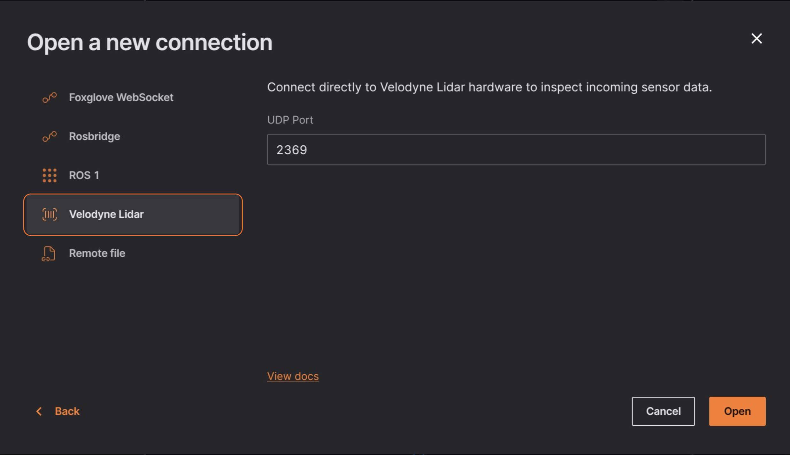

# Velodyne

Desktop Only
 
Velodyne sensors communicate using UDP sockets, which are not supported by web browsers. To establish a connection with a Velodyne sensor, please use our desktop application, which is designed to handle UDP communication reliably.

Connect to Velodyne Lidar to load live incoming data.

Select "Open connection" in the "Open data source" menu, and select the "Velodyne Lidar" option.

Enter the local UDP port on which you want to listen for Velodyne packets:

To test your connection, add a 3D panel to your layout, and open your panel settings to toggle on the velodyne topic. You should now see an interactive representation of your Lidar scan in a 3D scene.
