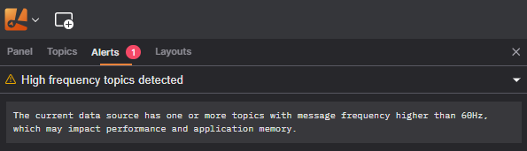

# Alerts

Lichtblick's alert system surfaces issues that occur during data playback, live connections, and panel processing so the user always knows when something needs attention.
Alerts appear in a dedicated **Alerts** panel, accessible from the sidebar, and are also reflected in the data source status indicator at the top of the application.

## Alert Severity Levels

Every alert has one of three severity levels:

| Severity    | Icon               | Meaning                                                                                                 |
| ----------- | ------------------ | ------------------------------------------------------------------------------------------------------- |
| **Error**   | 🔴 Red circle      | A serious problem that prevents data from being played back correctly or a connection from functioning. |
| **Warning** | 🟡 Yellow triangle | A potential issue that does not stop playback but may result in degraded or incomplete data.            |
| **Info**    | 🔵 Blue circle     | An informational notice; no action is required.                                                         |

---

## Where Alerts Appear

### Alerts tab

Open the **Alerts** tab in the left sidebar to see all active alerts. Each entry shows:

- The **severity icon** and **short message** in the header row.
- An expandable section with additional details, such as a full error message or a troubleshooting tip.

When there are no active alerts, the tab displays an empty state message confirming everything is healthy.

### Data source indicator

The data source name shown in the top bar changes color to reflect the highest-severity alert currently active. A red indicator means at least one error is present; yellow means warnings only.

---

## How Alerts Are Raised

Alerts come from two sources that are displayed together in the Alerts tab.

### Data source (player) alerts

These alerts are raised automatically by the active data source as it reads files or maintains a live connection. No additional configuration is needed — Lichtblick monitors the connection and data streams automatically.

Common situations that trigger player alerts:

- **Connection problems** — a WebSocket server is unreachable, the connection is dropped, or the server switches to reconnecting mode.
- **Unsupported encodings** — a topic uses a message encoding or schema format that Lichtblick cannot decode.
- **Duplicate or mis-advertised topics** — the server advertises the same topic name on more than one channel.
- **Service call issues** — a service uses a deprecated schema format, or no compatible encoding was found between client and server.
- **File format issues** — a bag file has overlapping chunks, an MCAP file is missing schema information, or a ROS 2 `.db3` file contains unresolvable types.
- **Playback cache limits** — the in-memory message cache is full, for example, when the browser tab has been inactive for a while.
- **High-frequency topic detection** — a topic is broadcasting messages at a rate that may affect visualization performance.

Player alerts are automatically resolved when the underlying condition clears (for example, when a connection is successfully re-established).

### Session alerts

Session alerts are raised programmatically during the current Lichtblick session. Unlike player alerts they persist until explicitly dismissed or until the session ends. Examples include:

- **Message converter errors** — an extension that converts messages from one schema to another encounters a problem and reports it.
- **User Script errors** — a script written in the User Scripts panel fails to compile or throws a runtime error. Open the User Scripts panel and inspect the **Alerts** tab there for the detailed diagnostic.
- **Topic alias conflicts** — an extension requests a topic alias that already exists in the data source, or two extensions request conflicting aliases for the same target topic name.

---

## How Extensions Interact with Alerts

Extensions can contribute alerts to the session through two mechanisms.

### Topic aliasing

Extensions can register **topic alias functions** that map source topic names to new virtual topic names. If an alias function produces a name that conflicts with an existing topic or with another extension's alias, Lichtblick raises an error alert automatically:

- _"Disallowed topic alias — Extension `<id>` aliased topic `<name>` is already present in the data source."_
- _"Disallowed topic alias — Extension `<id>` requested duplicate alias from topic `<source>` to topic `<name>`."_

These alerts appear in the Alerts tab and remain visible until the conflicting alias is removed or the extension is disabled.

### Message converters

Extensions that register [**message converters**](../extensions/extension-api/message-converters.md) (transforming messages from one schema into another) can report alerts while processing individual messages. Each converter alert is tagged with the extension ID and the schema pair it handles, so the user can quickly identify which converter encountered the problem.
Errors thrown by a message converter will also be caught and an alert will be shown to the user.

---

## Troubleshooting Tips

- **Expand an alert** to read the full error message and any available tip. Many alerts include a specific suggestion for resolving the issue.
- **User Script errors** will point to the User Scripts panel for detailed diagnostics — open it and check the Alerts tab there.
- **Connection alerts** often include the server URL and expected protocol version, making it easier to verify network settings or server configuration.
- **File format warnings** (e.g., overlapping bag chunks) do not stop playback but may increase memory usage. The alert tip will recommend a corrective action such as re-sorting the file.
- If an alert remains after the issue appears resolved, try **closing and re-opening** the data source to reset the player state or refreshing the application/page.
