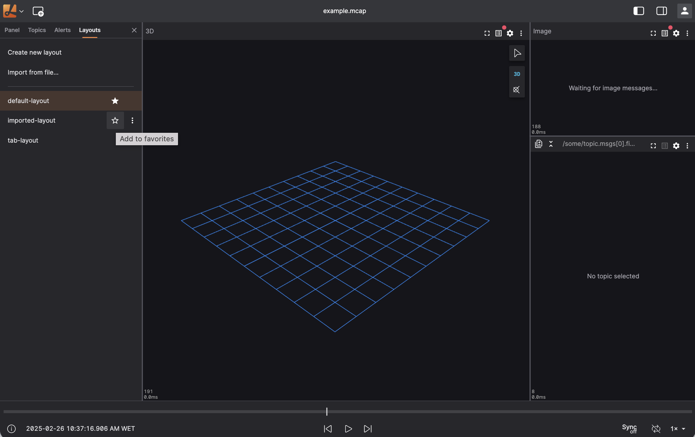

# Favorite Layouts

## Overview

Favoriting lets you mark the layouts you use most often so they're always easy to find. Both **Personal** layouts and layouts shared with your **Organization** can be favorited. Favorited layouts are pinned to the top of their section in the **Layouts** sidebar, and Lichtblick automatically opens a favorite layout on startup.

## Marking a Layout as Favorite

To mark a layout as a favorite:

1. Open the **Layouts** sidebar.
2. Hover over the layout you want to favorite.
3. Click the star icon next to the layout name.

A filled star indicates the layout is favorited; an outlined star indicates it is not. Once a layout is favorited, its star stays visible even when you aren't hovering over the row, so favorites are easy to spot at a glance.

Click the star again to remove the layout from your favorites.

## How Favorites Are Sorted

Favorited layouts are listed at the top of their section:

- **Personal** — layouts only you can see.
- **Organization** — layouts shared with your organization.

Within each section, favorited layouts are grouped first, followed by the rest. Both groups keep alphabetical order.

## Automatic Selection on Startup

When Lichtblick opens, it automatically selects a favorite layout if one exists:

- **Organization favorites take precedence over Personal favorites.**
- If multiple layouts are favorited within the same section, the alphabetically first one is selected.

:::note
A layout passed via the `--defaultLayout` CLI parameter (see [Layouts](./layouts.md#open-lichtblick-via-cli-with-a-layout-parameter)) always takes priority over a favorite. If no favorite layout exists, Lichtblick falls back to the layout you had open last.
:::

## Sharing a Favorited Layout

:::note
Sharing a favorited personal layout with your organization keeps the new shared copy favorited too.
:::

## Requirements and Limitations

- Favoriting an **Organization** layout requires you to be signed in and online. If you're offline, the star toggle is disabled and shows an **Offline** tooltip.
- Favoriting a **Personal** layout has no connectivity requirements — it's stored locally.
