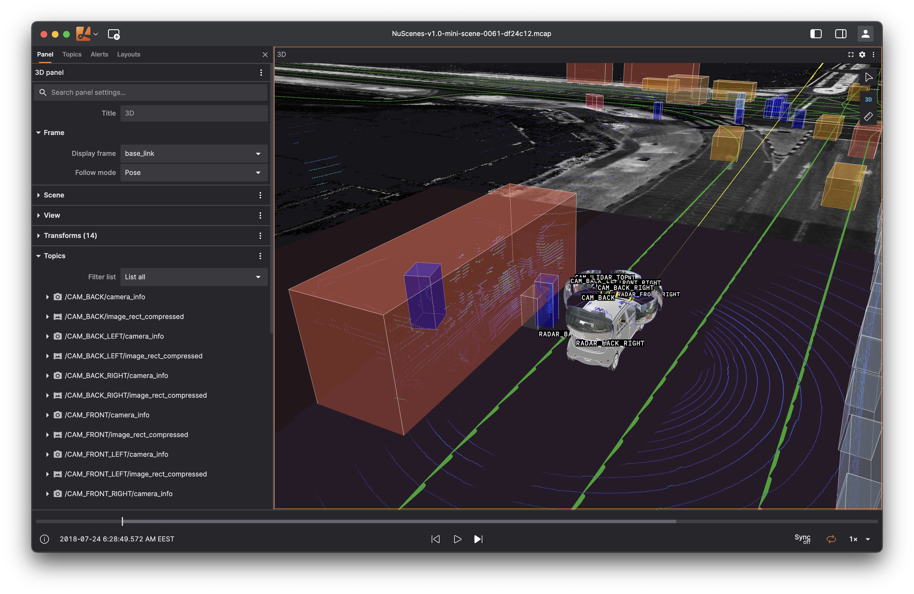
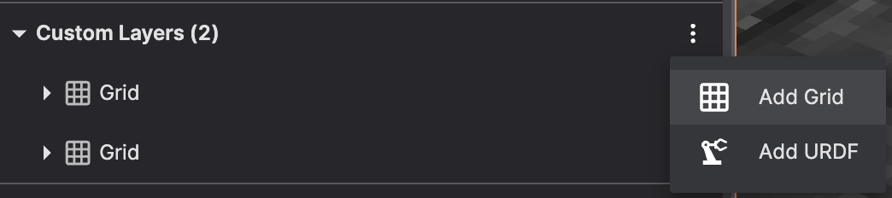
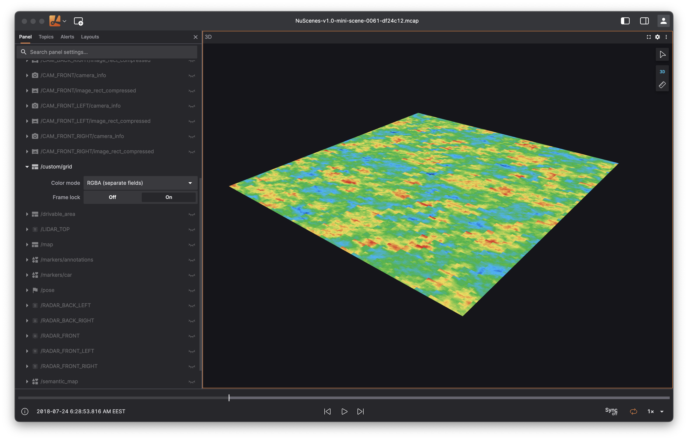
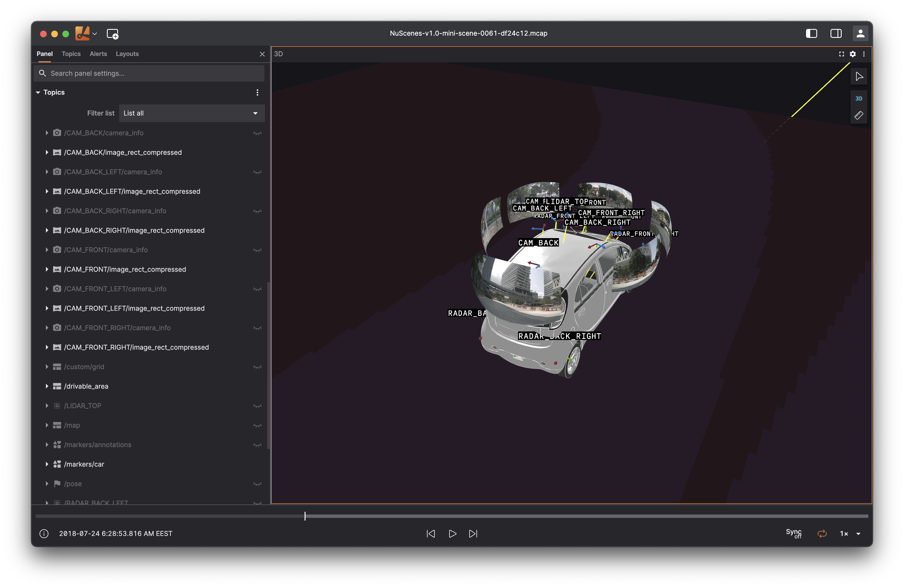
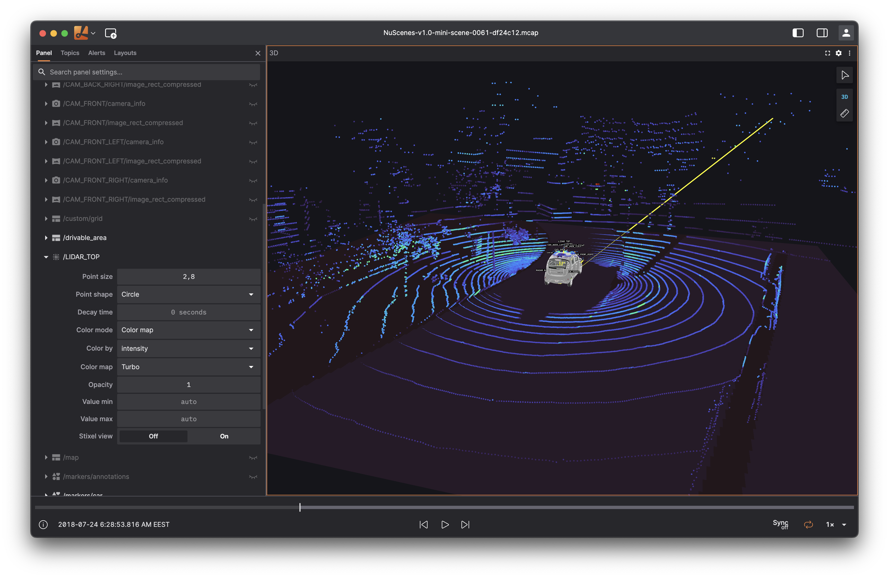
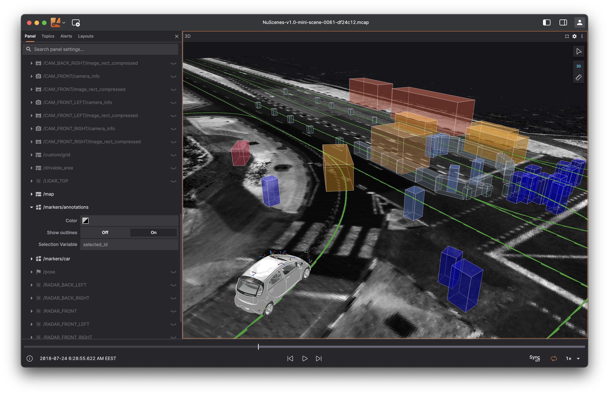
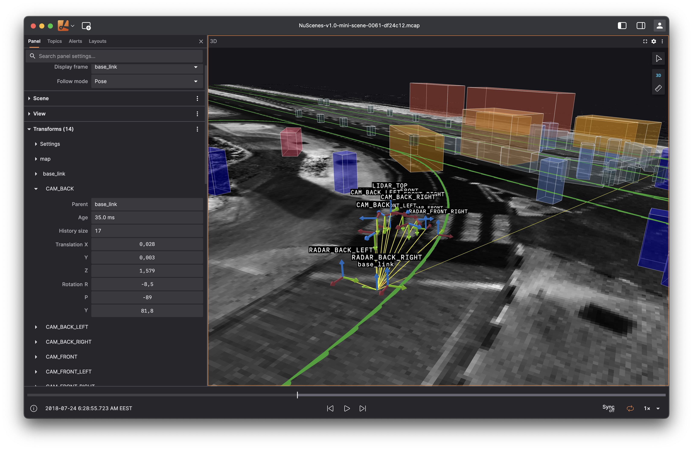

## Overview

Use the **3D panel** to render your data in a single interactive scene — from camera overlays and point clouds to URDF robot models, markers, and ad‑hoc primitives. The panel subscribes to enabled topics and draws the **latest message per topic** at its own timestamp, not by message receive time.

### Time & transforms (must‑read)

Rendering is timestamped. For any object to appear, there must be a **transform path** from the object’s frame to the panel’s **Display frame** _at or before the object’s timestamp_. Transform messages are consumed in log‑time order but **indexed by their own timestamp** so the scene reflects the state your robot had when it produced the data.

If an item is invisible, confirm:

- The message has a `timestamp` (or `header.stamp` in ROS).
- The relevant frames exist in your TF tree.
- A transform from the item’s `frame_id` to the Display frame exists at that time.

## Settings

### Frame

Configure your 3D scene's display frame and camera behavior.

| Field | Description |
| --- | --- |
| **Display frame** | The coordinate frame that your camera will follow. The fixed frame is automatically selected by traversing up the parent chain from the display frame to the tree root. |
| **Follow mode** | Camera movement relative to the display frame during playback: **Pose** (follows position and orientation), **Position** (position only), or **Fixed** (no viewport updates) |

### Scene

General rendering and viewport configuration.

| Field | Description |
| --- | --- |
| **Render stats** | Display performance statistics in the panel |
| **Background** | Scene background color |
| **Label scale** | Scale factor for all rendered labels |
| **Ignore COLLADA `<up_axis>`** | Match RViz behavior by ignoring up_axis tags in COLLADA files |
| **Mesh "up" axis** | Direction to use as "up" for meshes without orientation data (STL, OBJ) |

### View

Camera and viewport settings.

| Field | Description |
| --- | --- |
| **Sync camera** | Synchronize camera with other 3d panels using this setting |
| **Distance** | Camera distance from display frame origin |
| **Perspective** | Enable perspective projection (true 3D) vs orthographic (flat) |
| **3D view** | Toggle between 3D and 2D (top-down z-axis) views |
| **Target** | Translation offset from display frame origin |
| **Theta** | Azimuthal angle offset in degrees |
| **Phi** | Polar angle offset in degrees |
| **Y-axis FOV** | Vertical field of view in degrees |
| **Near/Far** | Clipping plane distances |

### Transforms

Configure transform visualization and behavior.

| Field | Description |
| --- | --- |
| **Editable** | Enable in-app editing of transform frames for debugging |
| **Labels** | Show transform labels in the scene |
| **Axis scale** | Size of transform axis markers |
| **Line width/color** | Appearance of transform line markers |
| **Enable preloading** | Preload transform messages (may impact performance) |

Robots generate messages from sensors and components across different coordinate frames. Transform data establishes spatial connections between these frames over time. For scene rendering to work, a valid transform chain must link each object's frame to the display frame.

Use transform visualization to troubleshoot missing or misaligned objects in your scene.

#### History

The panel maintains coordinate frame relationships over time using a transform history store. Each coordinate frame retains up to 10,000 transform messages before discarding the oldest entries as new messages arrive.

#### Preloading

Transform preloading in the 3D panel guarantees scene accuracy by caching transform messages in memory. Transform preloading may affect 3D panel performance during loading and seeking operations. You can turn off preloading in the 3D panel settings. However, when deactivated, the 3D panel may fail to correctly render your scene in specific situations involving sporadic coordinate frames. To maintain reasonable memory consumption, there is a maximum limit on the number of transforms that can be preloaded per topic.

### Topics

Manage which data streams are visualized in your 3D scene. The topics section displays all available message streams that contain supported 3D visualization data.

Toggle entire topic groups or individual topics using the visibility controls. Each topic includes format-specific visualization options that appear when expanded.

Click the eye icon beside any topic name to show or hide it from the scene. Use the master toggle to control all topics at once.

### Custom Layers

Add supplementary visualization elements that aren't tied to incoming message data.

#### Grid Layer

Create reference grids as 2D planes with customizable dimensions and subdivisions. Multiple grids can be added, each positioned relative to any coordinate frame in your transform tree.

Configure each grid's reference frame, size, appearance, division count, and visual properties through the layer settings panel.

#### URDF Layer

Display robot models using URDF (Unified Robot Description Format) files. When connected to ROS systems with a `/robot_description` parameter, models load automatically.

Manual URDF layers support various source types:

**Source Options:**

- **URL** — HTTP/HTTPS links or `package://` paths (requires desktop app or compatible bridge)
- **File** — Local file paths (desktop app only)
- **Parameter** — ROS parameter containing URDF content
- **Topic** — Message stream with URDF data

**Display Configuration:**

- **Label** — Custom name for the sidebar entry
- **Frame prefix** — Transform namespace for the robot's coordinate frames
- **Display mode** — Choose visual, collision, or automatic geometry rendering
- **Color/Opacity** — Fallback appearance when source lacks color information
- **Outlines/Axis** — Additional visual aids for debugging and inspection
- **Joint states** — Manual joint positioning (when not provided by transform data)
- **Link controls** — Individual link visibility and offset adjustments

## Supported inputs

The panel supports various message types for rendering 3D data. For ROS users, standard message types are supported alongside custom Foxglove schemas.

### Camera calibration

Camera intrinsic parameters for overlays and textured drawing.

[`CameraCalibration`](../message-schemas/camera-calibration.md)

### 2D Grids

2D Grid with optional coloring.

[`Grid`](../message-schemas/grid.md)

### Images

Camera images placed in the 3D scene using paired calibration.

[`RawImage`](../message-schemas/raw-image.md), [`CompressedImage`](../message-schemas/compressed-image.md), [`CompressedVideo`](../message-schemas/compressed-video.md)

### Laser scans

Single‑plane range scans.

[`LaserScan`](../message-schemas/laser-scan.md)

### Point clouds

N‑D point sets with configurable shapes (circle/square/cube) and optional fields like intensity and normals.

[`PointCloud`](../message-schemas/point-cloud.md)

### Poses

Single poses or arrays of poses in named frames.

[`PosesInFrame`](../message-schemas/poses-in-frame.md)

### Scene entities

High‑level primitives (boxes, spheres, lines, text, meshes) for bounding boxes, HD maps, and planning visualizations.

[`SceneEntity`](../message-schemas/scene-entity.md), [`SceneUpdate`](../message-schemas/scene-update.md)

### Transforms

Static/dynamic transforms between reference frames.

[`FrameTransform`](../message-schemas/frame-transform.md)

## Interactions

- Click objects to inspect details in the **Selected object** popup.
- Use the topic action icons to open **topic settings** or view **raw messages**.
- The right‑side toolbar includes: **Select**, **3D/2D toggle**, **Measure**.
- Selecting an entity sets `$selected_id` to its id (when available). For Scene Entities you can also set a **custom variable on click**.

### Camera controls (keyboard/mouse)

- `W A S D` — move camera
- `Shift + W/A/S/D` — rotate camera
- Scroll — zoom
- Drag — pan on ground plane (x‑y)

## Performance tips

- Large **Scene Entities** can accumulate and impact FPS; use topic throttling, decimation, or remove stale entities when possible.
- For heavy point clouds, try smaller point sizes or cube shapes only when necessary.
- Use lower message rates (< 50Hz) to avoid accumulation and FPS impact.
- **Disable preload transforms** can significantly improve performance and memory usage — check if it's needed for your specific use case.

## Troubleshooting

- **My data doesn’t render:** Confirm message timestamps, frame names, and that a transform exists to the Display frame at the message time.
- **Objects jump or flicker:** Check transform availability near message timestamps; add static transforms if appropriate.
