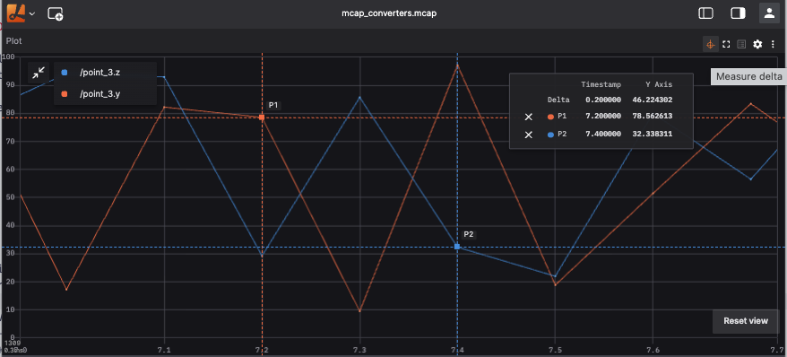

# Delta Measure Mode

Delta measure mode lets you compare two points in the **Plot** and **State Transitions** panels. It displays the distance between the points on the X axis and, when both values are numeric, the difference between their values on the Y axis.

Use this feature to measure elapsed time, compare signal values, or inspect state values at two points in a recording.

## Activate measure mode

1. Open a [**Plot panel**](./plot-panel.md) or [**State Transitions panel**](./state-transitions-panel.md).
2. Add the series or state paths you want to inspect.
3. Click the **measure mode icon** in the panel toolbar. The icon remains highlighted while measure mode is active.

## Place measurement markers

Click two points on the chart to place **Marker A** and **Marker B**. The panel shows an overlay with the values for each marker and their delta:

| Value | Description |
| --- | --- |
| **X** | The position of the marker on the X axis. For time-based plots, this is the timestamp or playback-time position. |
| **Y** | The value at the marker. |
| **Delta** | The absolute difference between the two marker positions or values. |

The overlay displays a placeholder until enough information is available. Click a marker's **close button** to remove it and place it again. You can drag the overlay to move it out of the way of the chart.

Press `Escape` or click the **toolbar icon** again to leave measure mode. Leaving the mode does not change the panel configuration.

## Plot panel

In the Plot panel, click a rendered data point to place a marker. The marker snaps to the nearest selectable point under the cursor. When multiple series are visible, the overlay reports each series value at the selected marker and the numeric delta for each series.

Values that are not numeric, such as strings and booleans, remain visible at each marker, but the panel does not calculate a Y delta for them. Time values are normalized so they can be compared numerically.

## State Transitions panel

In the State Transitions panel, click the chart at the desired position to place a marker. The overlay shows the state value for every configured series at each marker. This also supports discrete values such as booleans, strings, integers, and enum labels.

The State Transitions panel requires recorded data for chart click-to-seek behavior. It does not seek playback during a live connection.

## Marker behavior

Markers are cleared when you edit, reorder, remove, or change the relevant series or state-path configuration. Measure mode remains active, so you can place new markers immediately.

Measurement uses the absolute difference between marker positions and numeric values. A marker can be present without a calculated delta until the second marker is placed or a matching numeric value is available.
