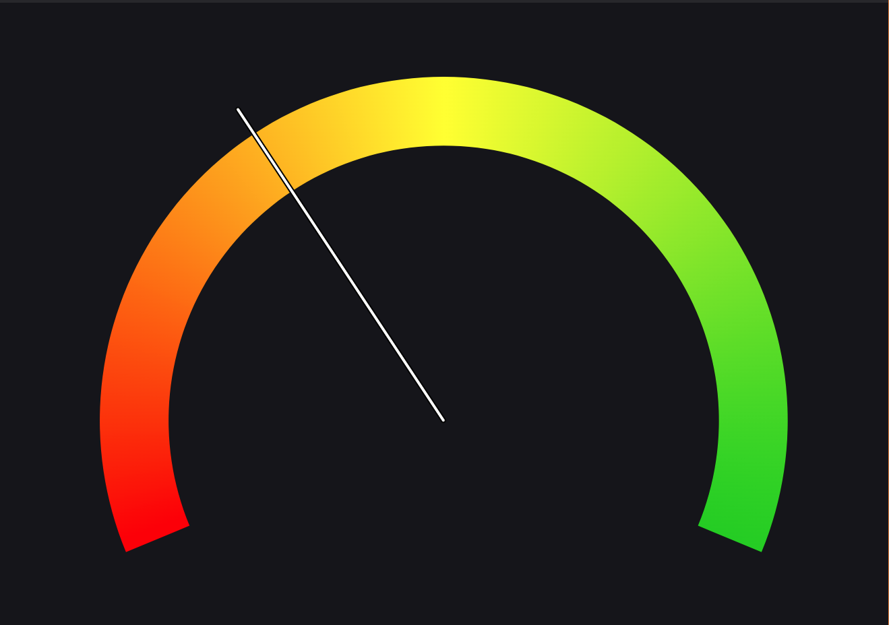

# Gauge Panel

The Gauge Panel in Lichtblick allows you to visualize numeric values from incoming topic [message paths](/visualization/message-path-syntax.md) on a customizable dial gauge display. It is useful for monitoring single numeric readings such as speed, temperature, battery level, or any other scalar measurement.

## Settings

### General

| Field             | Description                                                                                  |
| ----------------- | -------------------------------------------------------------------------------------------- |
| Message path      | Message path containing a numeric value (or a string that can be coerced to a numeric value) |
| Min               | Minimum value for the gauge                                                                  |
| Max               | Maximum value for the gauge                                                                  |
| Color mode        | Type of gradient to apply to the gauge                                                       |
| Color map         | Preset gradients for the gauge: `Red to green`, `Rainbow`, or `Turbo`                        |
| Reverse Colors    | Reverse the colors of the gauge                                                              |
