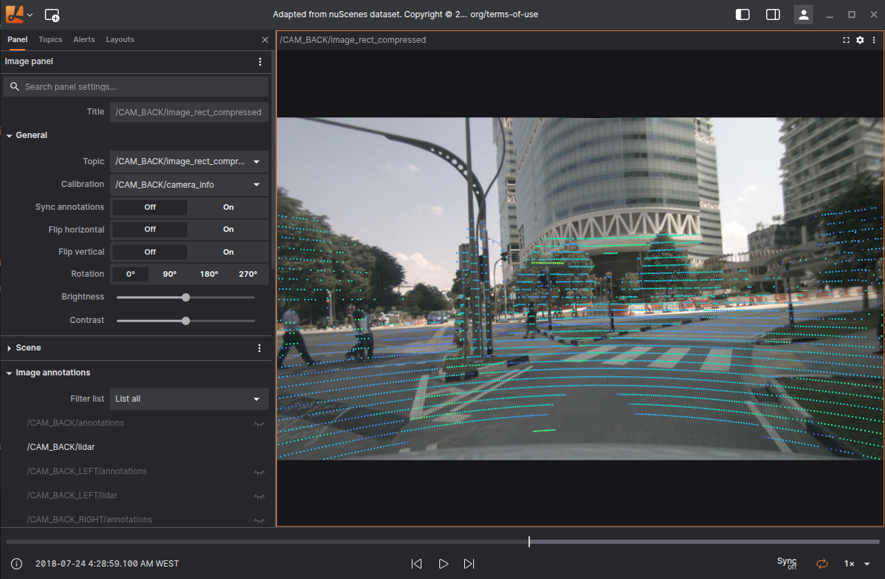
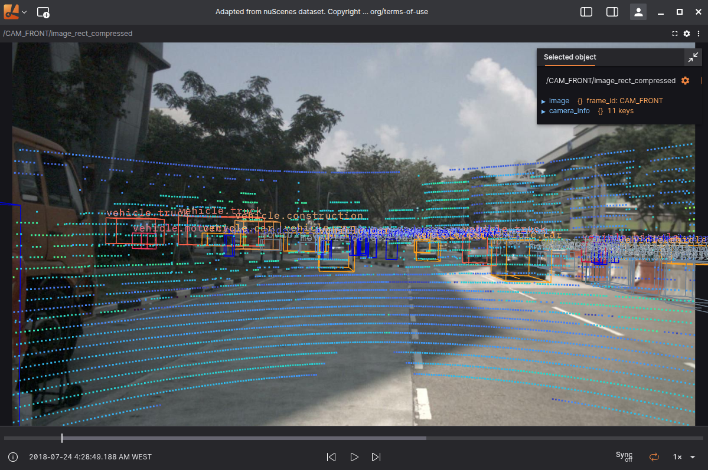

The Image Panel enables you to display raw and compressed image data, as well as compressed video streams, directly within the workspace. It supports intuitive 2D annotations—including text labels, circles, and key points—for contextual markup. Additionally, you can overlay 3D markers on top of the visual content to provide spatial insight and enhance data interpretation.

## Settings

### General

| Field              | Description |
|-------------------|-------------|
| **Topic**          | Select the camera image or video topic to visualize within the panel. |
| **Calibration**    | Choose the calibration topic used to apply distortion correction and enable accurate 3D marker placement. |
| **Sync annotations** | When enabled, images and 2D annotations are shown only when their timestamps align. Incoming annotation messages will be queued until a matching image frame is available. Not currently supported for *CompressedVideo* topics. |
| **Flip horizontal** | Mirrors the image across the vertical axis for alternate viewing orientation. |
| **Flip vertical**   | Mirrors the image across the horizontal axis to adjust the image orientation. |
| **Rotation**        | Rotates the image by 0°, 90°, 180°, or 270° to match display orientation needs. |
| **Brightness** | Adjusts the overall light intensity of the image to make it appear brighter or darker. |
| **Contrast** | Modifies the difference between light and dark areas to enhance or soften image details. |

### Scene

| Field | Description |
|--------|--------------|
| **Render stats** | Shows rendering performance metrics, such as frame rate, in the corner of the panel. |
| **Background** | Sets the background color that appears behind the displayed image. |
| **Label scale** | Adjusts the size of text labels rendered on top of the image or annotations. |
| **Ignore COLLADA `<up_axis>`** | When enabled, the `<up_axis>` data in COLLADA files is ignored during import. |
| **Mesh up-axis** | Defines the up-axis orientation ("Y-up" or "Z-up") used when loading mesh formats like STL or OBJ that lack orientation metadata. |

### Image annotations

2D image annotation marker topics to display.

### Transforms

List of transform messages to display.

See the [3D panel docs](./3d-panel.md#transforms) for more information on transforms.

### Topics
List of [3D marker topics](./3d-panel.md#topics) to superimpose on the image.

### Custom layers
See the [3D panel docs](./3d-panel.md) for more information on possible settings.

## Supported encodings

| Raw images | Compressed images | Compressed videos |
| ---------- | ----------------- | ----------------- |
| `8UC1`     | `webp`            | `h264`            |
| `8UC3`     | `jpeg`            | `h265` (HVEC)     |
| `16UC1`    | `jpg`             | `vp9`             |
| `32FC1`    | `png`             | `av1`             |
| `bayer_bggr8` | `avif`         |                   |
| `bayer_gbrg8` |                |                   |
| `bayer_grbg8` |                |                   |
| `bgr8`     |                   |                   |
| `bgra8`    |                   |                   |
| `mono8`    |                   |                   |
| `mono16`   |                   |                   |
| `rbg8`     |                   |                   |
| `rgba8`    |                   |                   |
| `uyvy` or `yuv4222` |          |                   |
| `yuyv` or `yuv422_yuy2 `|      |                   |

## Supported messages

#### `RawImage`

| framework | schema |
| --------- | ------ |
| ROS1      | [`sensor_msgs/Image`](https://docs.ros.org/en/noetic/api/sensor_msgs/html/msg/Image.html) |
| ROS2      | [`sensor_msgs/msg/Image`](https://github.com/ros2/common_interfaces/blob/master/sensor_msgs/msg/Image.msg) |
| Custom    | [`foxglove.RawImage`](../message-schemas/raw-image.md) |

#### `CompressedImage`

| framework | schema |
| --------- | ------ |
| ROS1      | [`sensor_msgs/CompressedImage`](https://docs.ros.org/en/api/sensor_msgs/html/msg/CompressedImage.html) |
| ROS2      | [`sensor_msgs/msg/CompressedImage`](https://github.com/ros2/common_interfaces/blob/master/sensor_msgs/msg/CompressedImage.msg) |
| Custom    | [`foxglove.CompressedImage`](../message-schemas/compressed-image.md) |

#### `CompressedVideo`

| framework | schema |
| --------- | ------ |
| ROS1      | [`foxglove_msgs/CompressedVideo`](https://github.com/foxglove/foxglove-sdk/blob/main/schemas/ros1/CompressedVideo.msg) |
| ROS2      | [`foxglove_msgs/msg/CompressedVideo`](https://github.com/foxglove/foxglove-sdk/blob/main/schemas/ros2/CompressedVideo.msg) |
| Custom    | [`foxglove.CompressedVideo`](../message-schemas/compressed-video.md) |

#### `CameraCalibration`

| framework | schema |
| --------- | ------ |
| ROS1      | [`sensor_msgs/CameraInfo`](https://docs.ros.org/en/noetic/api/sensor_msgs/html/msg/CameraInfo.html) |
| ROS2      | [`sensor_msgs/msg/CameraInfo`](https://github.com/ros2/common_interfaces/blob/master/sensor_msgs/msg/CameraInfo.msg) |
| Custom    | [`foxglove.CameraCalibration`](../message-schemas/camera-calibration.md) |

#### `ImageAnnotations`

| framework | schema |
| --------- | ------ |
| ROS1      | [`sensor_msgs/CameraInfo`](https://docs.ros.org/en/noetic/api/visualization_msgs/html/msg/ImageMarker.html) |
| ROS2      | [`sensor_msgs/msg/CameraInfo`](https://github.com/ros2/common_interfaces/blob/master/visualization_msgs/msg/ImageMarker.msg) |
| Custom    | [`foxglove.CameraCalibration`](../message-schemas/image-annotations.md) |

## Controls and shortcuts

- Scroll – Zoom in and out
- Drag – Pan around the image
- Right-click on the image to download it as a PNG file.

Like on the 3D panel you can select objects displayed.

## Troubleshoot video

If you notice warnings for `foxglove.CompressedVideo` topics about frames being delayed, and the delay keeps increasing during playback, the issue may be related to the video decoder on your platform. Decoding performance varies across devices—some handle streams with low latency, while others introduce noticeable delay. While you can optimize your video encoding for low-latency playback, zero delay cannot be guaranteed on all platforms.

Tips for Low-Latency Video Encoding

Use the `BASELINE` profile for `H.264`, as it avoids B-frames which add decoding delay.

Disable frame reordering in your encoder settings.

Use lower profile levels (level_idc) to reduce buffer size and latency.

If available, set `bitstream_restriction` in VUI parameters to limit buffer size (max_dec_frame_buffering) and disable reordering (max_num_reorder_frames).

If Delay Continues to Increase

This usually indicates that decoding can't keep up with the incoming stream. Try reducing the number of active video panels and verify that your system supports hardware-accelerated decoding.

High CPU load and power constraints can also affect performance. Hardware decoding is faster and more efficient, so ensure it’s enabled where possible.

These optimizations can reduce latency but may behave differently depending on your device and platform.

## Checking Video Acceleration

To verify hardware-accelerated video decoding support:

Open Google Chrome and go to `chrome://gpu`.

Look for `Video Decode: Hardware accelerated.`
If it's missing or the Video Acceleration section is empty when you expect support, additional platform-specific setup may be required.

The Lichtblick desktop app is built with Electron (Chromium-based) and will use hardware acceleration when available. If you notice issues, first confirm acceleration in Chrome, if it's not working there, it likely won't work in the desktop app either. Get it working in Chrome first, then report any remaining issues with the app.

## Enabling Hardware Acceleration
**In Chromium-based browsers (Foxglove Web)**:

- Go to `chrome://settings` → search for acceleration → enable `Use graphics acceleration when available`.

- Go to `chrome://flags` → search for video → enable `Hardware-accelerated video decode`.

**macOS**:

- For web usage, switching the graphics backend to Metal via `about://flags` in Chromium browsers can significantly improve performance.

**Linux**:

- Chrome/Chromium does not enable video acceleration by default on Linux. Custom flags may be required depending on your GPU.

- Make sure your graphics drivers are correctly installed and up to date.

