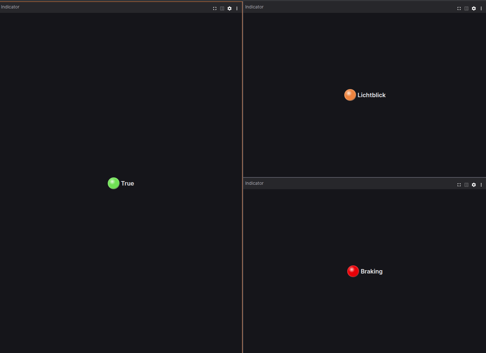

# Indicator Panel

The Indicator Panel in Lichtblick displays a color-coded label to indicate threshold values in your data. It is useful for providing at-a-glance status information, such as whether a sensor reading is within acceptable limits or if a system state requires attention.

## Settings

### General

| Field | Description                                  |
| ----- | -------------------------------------------- |
| Data  | Message path to the data                     |
| Style | Style of indicator (`Bulb` or `Background`)  |

### Rules (first matching rule wins)

Add, edit, and reorder the rules that determine when the indicator should display different colors or labels. The first rule whose condition matches the incoming data will be applied.

| Field        | Description                                                                                                                              |
| ------------ | ---------------------------------------------------------------------------------------------------------------------------------------- |
| Comparison   | How to evaluate incoming data against the `Compare with` value (`Equal to`, `Less than`, `Less than or equal to`, `Greater than`, or `Greater than or equal to`) |
| Compare with | Threshold or reference value to compare against (string, number, or boolean)                                                             |
| Color        | Color to display when this rule matches                                                                                                  |
| Label        | Text label to display when this rule matches                                                                                             |
