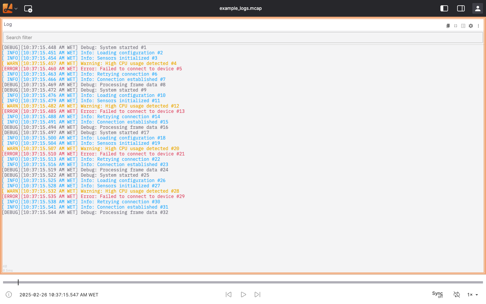
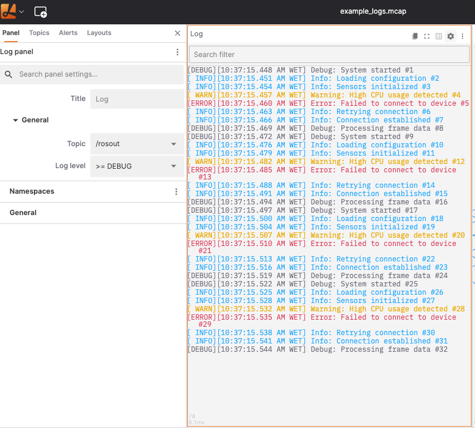
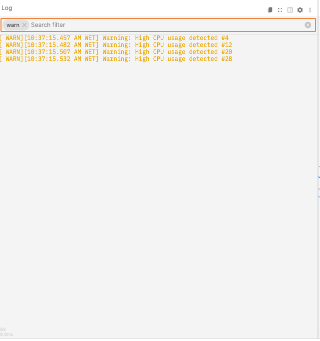

# Log Panel

The Log panel displays log messages received on a configurable topic. Each message is shown with its severity level, timestamp, source node name, and text content. Use the panel to monitor robot diagnostics during live operation or inspect messages during recording playback.



## Settings

Open settings by clicking the gear icon in the panel toolbar, or by selecting the panel so its settings appear in the sidebar.



### General

| Field | Description |
| --- | --- |
| **Topic** | The log topic to subscribe to. Auto-selects the first available supported topic, falling back to `/rosout` if none are found. Only topics with a supported log schema are listed. |
| **Log level** | Minimum severity level to display. Messages below this level are hidden. |

**Log level** options:

| Value | Meaning |
| --- | --- |
| `>= DEBUG` | Show all messages |
| `>= INFO` | Hide debug messages |
| `>= WARN` | Hide debug and info messages |
| `>= ERROR` | Show errors and fatal messages only |
| `>= FATAL` | Show fatal messages only |

### Namespaces

The **Namespaces** section lists every unique node name seen in the current session. Use the visibility toggles to show or hide messages from individual namespaces.

Two bulk actions are available via the section menu:

| Action | Effect |
| --- | --- |
| **Show all** | Make all namespaces visible |
| **Hide all** | Hide all namespaces |

## Search filter

The search filter bar at the top of the panel filters the visible messages by text. A message is shown if its node name or message content contains the entered term. Multiple search terms can be added as individual tags.



## Message display

Each log entry is displayed on one or more lines using a monospace font:

```text
[LEVEL] [timestamp] [node-name]: message text
```

Messages are color-coded by severity level:

| Level | Color |
| --- | --- |
| `FATAL` | Red, **bold** |
| `ERROR` | Red |
| `WARN` | Yellow / amber |
| `INFO` | Theme info color (typically blue) |
| `DEBUG` | Dimmed text color |

## Auto-scroll

The panel automatically scrolls to the latest message as new entries arrive. Scrolling up manually pauses auto-scroll. A **scroll-to-bottom** button appears in the lower-right corner when auto-scroll is paused; click it to resume.

## Copy logs

Click the **Copy Logs** button (clipboard icon) in the panel toolbar to copy all currently visible log messages to the clipboard. Each message is copied as a single line in the same format shown in the panel. A notification confirms when the copy succeeds.

## Supported messages

| Schema | Source |
| --- | --- |
| [`foxglove.Log`](../message-schemas/log.md) | Foxglove (custom encoding) |
| `foxglove_msgs/Log` | ROS 1 |
| `foxglove_msgs/msg/Log` | ROS 2 |
| `foxglove::Log` | OMG IDL |
| `rosgraph_msgs/Log` | ROS 1 (native) |
| `ros.rosgraph_msgs.Log` | ROS 1 (native, ROS bridge) |
| `rcl_interfaces/msg/Log` | ROS 2 (native) |
| `ros.rcl_interfaces.Log` | ROS 2 (native, ROS bridge) |
