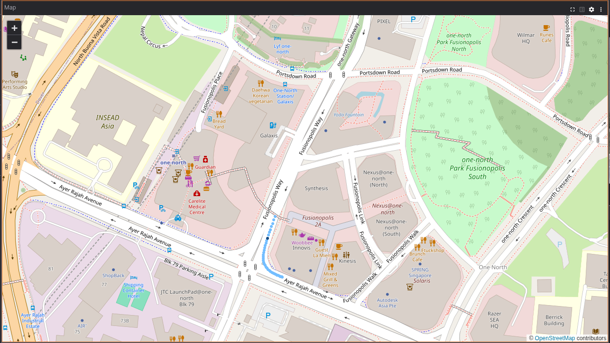

Display GPS and GeoJSON data on a world map.



## Supported Messages

To use this panel, your data must include messages that conform to one of the supported schemas listed below.

#### `LocationFix`

Used for GPS coordinates, with the ability to show signal accuracy when available. If the message contains a metadata field, an array of key-value pairs, those values will appear in a tooltip when hovering over the point.

| Framework     | Schema |
|---------------|--------|
| ROS 1         | [sensor_msgs/NavSatFix](https://docs.ros.org/en/api/sensor_msgs/html/msg/NavSatFix.html) |
| ROS 2         | [sensor_msgs/msg/NavSatFix](https://github.com/ros2/common_interfaces/blob/master/sensor_msgs/msg/NavSatFix.msg) |
| Custom        | [foxglove.LocationFix](https://lichtblick-suite.github.io/docs/docs/visualization/message-schemas/location-fix) |

#### `GeoJSON`

For displaying arbitrary shapes or points.

| Framework     | schema |
|---------------|--------|
| Custom        | [foxglove.GeoJSON](https://lichtblick-suite.github.io/docs/docs/visualization/message-schemas/geojson) |

The following fields from each feature's `properties` object are shown in the tooltip when hovering:

- **`name`** – Rendered as a "Name" row.
- **`metadata`** – Extra key-value information. Accepted formats:
  - A string, shown as a single "Metadata" row
  - An array of `{ "key": "Zone", "value": "north" }` objects, each rendered as a separate labeled row
  - A plain object (e.g. `{ "Zone": "north", "Priority": "high" }`), where every entry becomes a labeled row

To apply visual styling to objects on the map, use the `style` field inside each feature's `properties`:

```json
{
  "type": "FeatureCollection",
  "features": [
    {
      "type": "Feature",
      "properties": {
        "name": "Name of map entity",
        "metadata": [
          { "key": "Zone", "value": "north-sector" },
          { "key": "Status", "value": "active" }
        ],
        "style": {
          "color": "#ff0000",
          "dashArray": "4 4",
          "lineCap": "butt",
          "opacity": "1",
          "weight": 4
        }
      },
      "geometry": "..."
    }
  ]
}
```

See the [Leaflet documentation](https://leafletjs.com/reference.html#path) for additional supported style attributes.

## Settings

### General

| Field | Description |
|-------|-------------|
| **Base layer** | The map style used as the background. Options: <br/>**Street** (© OpenStreetMap contributors), <br/>**Satellite** (© Esri — Esri, i-cubed, USDA, USGS, AEX, GeoEye, Getmapping, Aerogrid, IGN, IGP, UPR-EGP, and the GIS User Community), <br/>**Shaded relief** (GEBCO grayscale bathymetry), <br/>**Custom** – fetch tiles from a user-defined URL (Team and Enterprise plans only) |
| **Custom map tile URL** | Shown when **Custom** is selected. URL pointing to your tile source, following the Tile Map Service specification — e.g. `https://my.custom.url/{x}/{y}/{z}.png` |
| **Max tile level** | Shown when **Custom** is selected. The maximum zoom level supported by the custom tile source. Refer to the Leaflet documentation for details. |
| **Follow topic** | The topic the panel viewport should track |
| **Location fix** | The specific location fix to follow. Only shown when the selected follow topic contains multiple fixes (e.g. via [`foxglove.LocationFixes`](https://lichtblick-suite.github.io/docs/docs/visualization/message-schemas/location-fix) ) |

### Layers

Add extra layers on top of the base map to enrich the display with additional information, such as nautical charts, topographic data, or custom tile sources.

| Field | Description |
|-------|-------------|
| **Type** | The layer style to apply. Options: <br/>**Street** (© OpenStreetMap contributors), <br/>**Satellite** (© Esri), <br/>**Shaded relief** (GEBCO grayscale bathymetry), <br/>**Sea marks** (OpenSeaMap nautical markers), <br/>**Isobaths** (OpenSeaMap depth contours), <br/>**Custom** – fetch tiles from a user-defined URL (Team and Enterprise plans only) |
| **Custom map tile URL** | Shown when **Custom** is selected. URL to your tile source following the Tile Map Service specification — e.g. `https://my.custom.url/{x}/{y}/{z}.png`. See [Leaflet's TileLayer documentation](https://leafletjs.com/reference.html#tilelayer) for details. Most [`OpenStreetMap-based services`](https://wiki.openstreetmap.org/wiki/List_of_OSM-based_services) are also compatible. |
| **Opacity** | Controls how visible the layer is, ranging from fully transparent (`0`) to fully opaque (`1`) |

Use the layer action controls to:

- Toggle the visibility of individual layers
- Reorder layers (move up or down) to control how they stack
- Remove layers

### Topics

The **Topics** section lets you manage visibility and configure settings per topic.

| Field | Description |
|-------|-------------|
| **Coloring** | How GPS or GeoJSON features are colored. <br/>**Automatic**: color is assigned automatically. <br/>**Custom**: choose your own color. |
| **Marker** | Shape used to represent GPS locations. <br/>**Pin**: standard pin icon (fixed blue). <br/>**Dot**: circle. <br/>**Diamond**: rhombus. <br/>**Square**: square. <br/>**Plus**: plus sign (`+`). <br/>**Cross**: X shape. |
| **Point size** | Diameter in pixels of points rendered on the map for this topic |
| **Time range** | Determines which messages are shown. <br/>**Latest**: only the most recent message. <br/>**All previous**: all messages from the start up to the current playback position. <br/>**Last N seconds**: messages within a sliding window relative to current playback time. <br/>**All**: every available message for the topic. |
| **Seconds** | Shown when **Last N seconds** is selected. The size of the time window in seconds relative to current playback time (default: `30`) |

### Using Custom Maps

To load a custom map layer, provide a URL serving rasterized slippy tiles that follow the [Tile Map Service specification](https://wiki.osgeo.org/wiki/Tile_Map_Service_Specification) with Web Mercator projection. Refer to [Leaflet's TileLayer documentation](https://leafletjs.com/reference.html#tilelayer) for guidance on constructing URL templates. Most OpenStreetMap-based services are compatible. See [Switch2OSM](https://switch2osm.org/serving-tiles/) for information on hosting your own tiles.

### Controls and Shortcuts

- Hover over the playback bar to highlight the map points corresponding to that moment in time
- Hover over a map point to highlight its position in the playback bar
- Click a map point to seek playback to that timestamp
- Scroll over the map to zoom; drag to pan — zoom and pan state is saved to the layout
