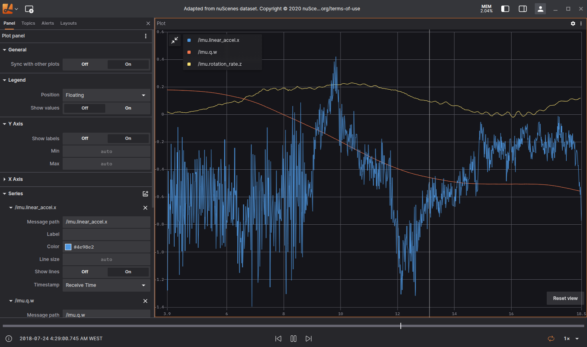
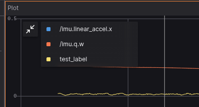
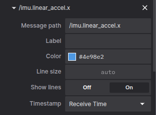

# Plot

The Plot Panel in Lichtblick is a user interface component designed to facilitate the visualization and control of plotting data. It allows to view, modify, and export graphical representations of datasets or modeling results.

## Settings

### General

| Field                 | Descripiton                  |
| --------------------- | ---------------------------- |
| Sync with other plots | Sync timeline to other plots |

### Legend

| Field | Descripiton |
| --- | --- |
| Dislpay Legend | To display or hide the legend use the icon on the top left of the Plot |
| Position | Allows the user to select the position of the legend relative to the plot: <ul><li>Floating</li><li>Left</li><li>Top</li><li>Hidden</li></ul> |
| Show Values | Shows the current y-axis value to the corresponding series in the legend |

Plot series legend.

### Y Axis

| Field | Descripiton |
| --- | --- |
| Show labels | Option to select if the values are shown, or not, near the y-axis |
| Min | Minimum value for y-axis |
| Max | Maximum value for y-axis |

### X Axis

| Field | Descripiton |
| --- | --- |
| Default Value | Selects the default value for x-axis. Can also be defined individually for each series |
| Show labels | Option to select if the values are shown, or not, near the y-axis |
| Min | Minimum value for y-axis |
| Max | Maximum value for y-axis |
| Range (seconds) | For time series data, selects the time interval of data that will be shown after the current playback point |

### Series

| Field | Descripiton |
| --- | --- |
| Message path | Message path containing x-axis values for the series. Will override default x-axis values if set |
| Label | Label that can be given to the series |
| Color | Color used on the series |
| Line size | Width of line connecting data points |
| Show lines | Show lines connecting data points. Active by default |
| Timestamp | For time serie plots, selects the time information used for message ordening: <ul><li>**Receive time:** is a time that refers to the when a message is received by `Lichtblick`, not when was originally published</li><li>**Header stamp:** is a `header.stamp` [ROS1](../../connecting-to-data/ros1.md) or [ROS2](../../connecting-to-data/ros2.md) field containing `sec` and `nsec` integers</li></ul> |

To remove a series from the Panel you use the `x`, next to each data series, like it's shown below.

To enter the data you wanna plot use the message path syntax, `Lichtblick` will also show suggestions that exits on the topics available.

You can also hover the plot to see the details in a tooltip. A vertical bar will appear, as well as a yellow marker on the playback timeline. If clicked the playback will jump to that point on the timeline.

## Download CSV data

With right click mouse button an option to download the plotted as `.csv` will appear.
