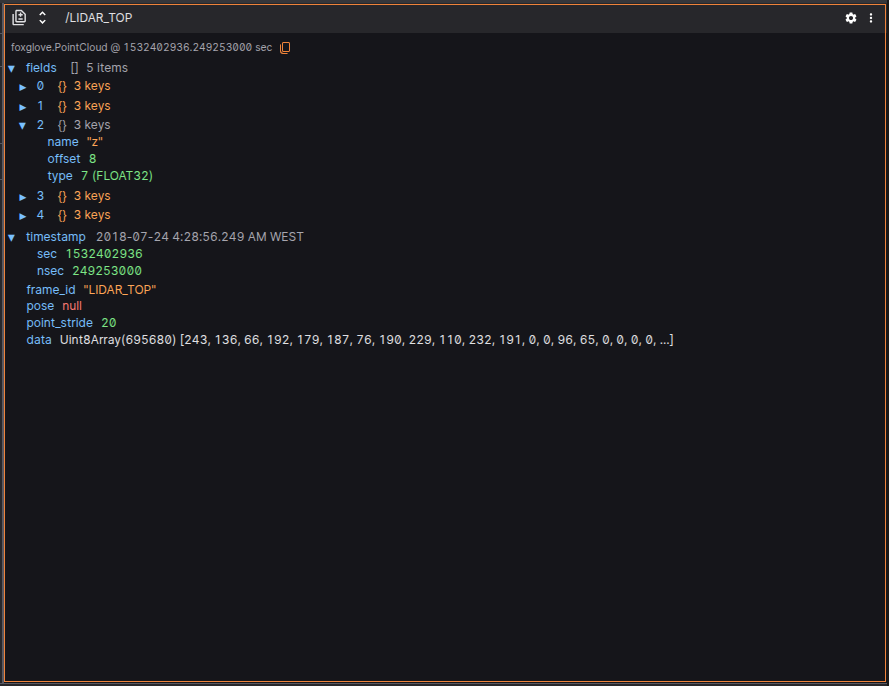
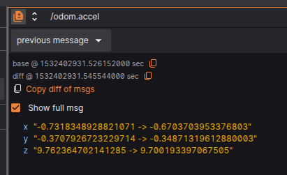
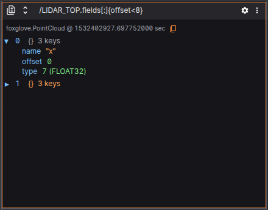
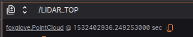
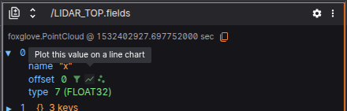
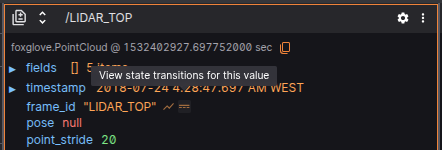
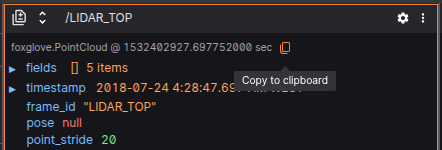
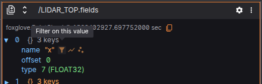
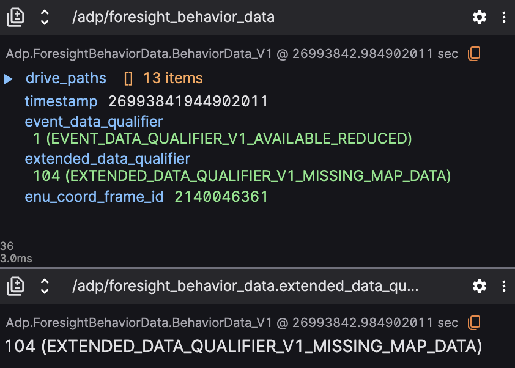

# Raw Messages

The **Raw Messages** panel in Lichtblick is a powerful debugging and inspection tool that enables users to visualize raw [ROS](/connecting-to-data/frameworks/ros1.md) or [MCAP](/connecting-to-data/frameworks/mcap.md) messages in a structured and interactive JSON format. It is particularly useful for understanding message structures, tracking state changes over time, and drilling into specific message fields for advanced diagnostics or visualizations.

As new messages are received for a specific path, the panel tree will show just the last message. It's also possible to expand and collapse keys, and that will persist across playback

## Features

### 1. Diff mode

Compares messages showing additions (green), deletions (red), and changes (yellow) to their fields across 2 categories:

- `previous message` - Compare the immediately previous message on the same message path;
- `custom` - Compare different topic messages in the same timestamp;

### 2. Advanced Filtering

Users can define custom filters using logical expressions to isolate specific parts of the message. Supported features include:

- **Array filtering**, e.g., `signals[0]`
- **Logical operators**, e.g., `fields[:]{offset<5}`
- **Global variables**, such as `$last`, `$index`, or other runtime context helpers

Filters are written in a JavaScript-like syntax, parsed and validated in real time.

### 3. Hyperlinks to message schmemas documentation

A link to documentation about the selected schema is available at the top.

### 4. Contextual Actions (Right-click or Click)

Hovering over a field provides contextual actions, such as:

- **Plot this variable**

- **Open state transition visualization**

- **Copy full path to field**

- **Set as filter base**

This improves usability when exploring complex or unfamiliar messages.

### 5. Structured JSON Message View

Each message is displayed as a JSON object, preserving full structural fidelity. The panel supports:

- **Primitive types** (string, number, boolean)
- **Arrays**, with collapsible sections
- **Objects**, with recursive expansion
- **Enumerations**, shown with both label and numeric value (e.g., `"state": "RUNNING (1)"`)

## Settings

| Field     | Descripiton                               |
| --------- | ----------------------------------------- |
| Font size | Font size for text displayed on the panel |

## Best Practices

- Use **filters** to reduce noise when debugging high-frequency topics.
- Combine **drag-and-drop** with plots for rapid visualization of numerical data.
- Enable **diff mode** to track how actuator or decision variables evolve.
- Use **contextual actions** for quicker navigation between panels.
