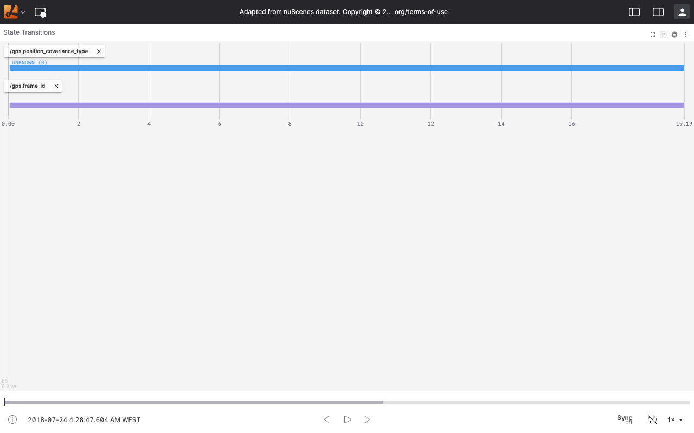
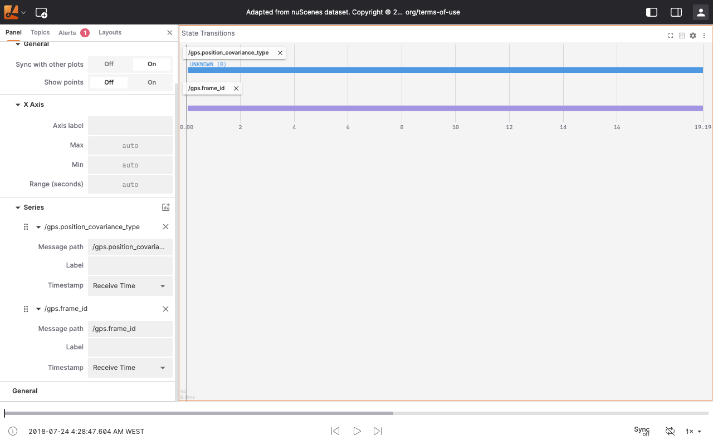

# State Transitions

The State Transitions panel tracks how discrete values evolve throughout a recording. It renders a horizontal timeline bar for each configured series, highlighting the moments when values change. This makes it straightforward to spot state shifts and correlate them with other events during playback.

Configure series using [message path syntax](../message-path-syntax.md). Supported value types include `bool`, `string`, and all integer types (`int8` through `uint64`).

:::note
If your ROS message definition includes constants, they appear as labels next to each enum value. Define only one set of enum constants per message definition — otherwise Lichtblick has no way to resolve which constant name applies when values overlap.
:::

## Settings

Open settings by clicking the gear icon in the panel toolbar, or by selecting the panel so its settings appear in the sidebar.

### General

| Field | Description |
| --- | --- |
| Sync with other plots | Link pan and zoom actions across all plot-type panels |
| Show points | Render a marker at each incoming state transition message |

### X Axis

| Field | Description |
| --- | --- |
| Axis label | Custom text shown beneath the time axis |
| Max | Upper bound of the visible time range |
| Min | Lower bound of the visible time range |
| Range (seconds) | Duration of the visible time window in seconds |

### Series

You can add multiple series to monitor different discrete values simultaneously. Click **Add series** to configure a new one.

| Field | Description |
| --- | --- |
| Message path | Path to the field whose discrete values you want to plot |
| Label | Custom name shown in the panel legend for this series |
| Timestamp | Determines how messages are ordered on the time axis: **Receive Time** or **Header Stamp** |

## Controls and shortcuts

### Pan and zoom

Drag anywhere on the chart to pan the visible time range.

Use the scroll wheel or trackpad gesture to zoom in and out along the time axis.

To restore the default view, press `r` or double-click the chart area.

### Scroll vertically

When not all series fit in the viewport, use the scrollbar on the right side of the panel to scroll vertically.

### Click-to-seek

Move the cursor over the chart to inspect state values at a specific moment — a tooltip displays the current value and a vertical yellow indicator marks the time position. A matching marker also appears on the playback timeline bar. Click anywhere on the chart to jump playback to that point in time.

:::note
This feature requires recorded data and is not available during live connections.
:::
