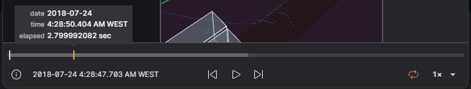

# Playback

Lichtblick enables seamless navigation through both local and remote datasets using its playback controls.

## Message Sequencing

Messages within Lichtblick are arranged and played in order of their log timestamps. The log timestamp typically represents the moment a message was captured but can be adjusted to reflect the most relevant time context for your analysis. Selecting an appropriate timestamp is crucial, as external factors such as network delays, buffering, or batch processing can introduce time discrepancies.

In robotics, messages often carry multiple timestamps beyond the log time. Lichtblick’s Plot and State Transitions panels allow users to organize data using alternative timestamps:

| Timestamp | Source | Description |
| --- | --- | --- |
| Header Stamp | ROS 1, ROS 2, custom messages | The `header.stamp` field contains separate `sec` and `nsec` values representing the recorded time. |
| Publish Time | MCAP | A specialized MCAP field that optionally records the time a message was published. |

## Message Handling and Optimization

Lichtblick is designed to efficiently manage large-scale robotics data, ensuring smooth navigation and playback.

### Retrospective Message Fetching

When seeking a specific point in the data stream, it is unlikely that every subscribed topic has a message at the exact timestamp selected. To maintain data consistency across panels, Lichtblick implements a retrospective search for the most recent message on each topic. This ensures that when navigating to arbitrary time points, all active panels retain relevant and contextually accurate data.

### Persistent Data for Latched Topics

By default, Lichtblick retains the latest received messages for all topics when handling ROS 1 `.bag` files, MCAP files, or direct Lichtblick data streams. When navigating through time, Lichtblick retrieves and displays the most recent messages from all topics, even if they were recorded minutes before the selected timestamp. This feature allows panels to visualize infrequently published data reliably, ensuring continuity even when reviewing sparse datasets.

### Data Preloading for Enhanced Visualization

Certain Lichtblick panels, such as the Plot and Map panels, benefit from accessing data spanning the entire recording duration. Preloading enables these panels to analyze complete historical trends, detect anomalies, and observe long-term behavioral patterns in robotic systems.

Even panels that primarily display the latest data, such as the 3D panel, take advantage of preloaded data for precise rendering. For example, the 3D visualization panel preloads transformation messages to correctly position objects in a unified coordinate frame. In robotics, multiple reference frames (e.g., robotic arm joints, autonomous vehicle sensors) must be aligned for accurate visualization. Preloading ensures that Lichtblick has access to all necessary transform data, preventing inconsistencies in rendering dynamic robotic systems.

## Shortcuts

`Space` - pause or play  `shift` + ⬅️ - seek backward 10ms   `shift` + ➡️ - seek forward 10 ms   ⬅️ - seek backward 100ms   ➡️ - seek forward 100ms   `Alt` + ⬅️ - seek backward 500ms   `Alt` + ➡️ - seek forward 500ms
