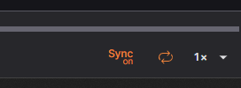

# Synchronizing Instances

## Overview

The _Lichtblick Sync_ feature allows users to synchronize playback actions—such as **play**, **pause**, **seek**, and **play until**—across multiple running instances of Lichtblick on the same platform (desktop-to-desktop or web-to-web). This is especially useful for users working on multi-window/multi-screen setups and comparing MCAPs.

## Using the Sync Feature

Once the toggle is **on**, the current instance will **broadcast** playback actions to other active instances running on the same platform.

### Supported Broadcast Actions:

| Action         | Description                                                         |
| -------------- | ------------------------------------------------------------------- |
| **Play**       | Triggers play on all synced instances, starting from the same time. |
| **Pause**      | Pauses all synced instances at the same timestamp.                  |
| **Seek**       | Seeks all synced instances to a specific point.                     |
| **Play Until** | Triggers conditional playback up to a given time across instances.  |

> 🔁 Each instance independently process its own data, but reacts to common control commands.

## Requirements and Best Practices

To ensure the feature works properly:

- All instances must be:

  - Open on the **same platform**: either all desktop or all web.
  - Ideally running **Lichtblick** with **the same file**.
  - **Aligned on playback range**: The files should cover the same time range.  
    **Otherwise, syncing behavior may be inconsistent.**

- Ensure the "Sync" toggle is **enabled** in all relevant instances.

## Limitations

- **Experimental Feature**:  
  This feature is still under evaluation and subject to change.

- **Platform isolation**:  
  Synchronization only works between instances on the same platform:

  - **Desktop-to-desktop** ✅
  - **Web-to-web** ✅
  - **Desktop-to-web** ❌

- **Performance-sensitive behavior**:  
  If one instance is under high load (e.g., parsing many topics), it might lag behind others.  
  Even though actions are synchronized via broadcast, **visual synchronization accuracy may vary** depending on system performance and buffering behavior.

- **Timing offsets may occur**:  
  Playback buffering is local to each instance. The sync mechanism sends time targets, but **frame-perfect synchronization is not guaranteed**.
