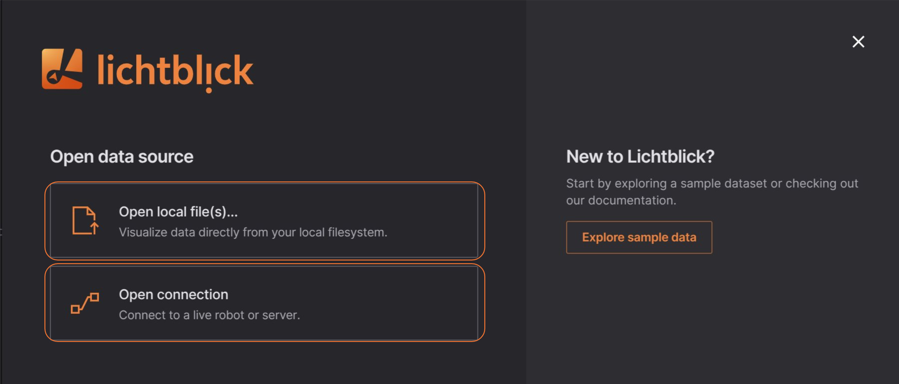

# Introduction

To begin visualizing data, navigate to the Lichtblick dashboard and select a data source option.

## Data Source

Lichtblick allows its users to open data via two options, either a [local data source](./local-data.md) or a [live data source](./live-data.md).

|   | Use Case         | Supported Formats           |
|---|------------------|-----------------------------|
| [Local Data](./local-data.md)   `Open local file(s)...` | Allows to open and inspect data saved locally | <ul><li>[MCAP](./mcap.md)</li><li>[ROS 1](./ros1.md)</li><li>[PX4 Ulog](./px-4.md)</li></ul>        |
| [Live Data](./live-data.md)   `Open connection` | Inspect real-time incoming data  | <ul><li>[MCAP](./mcap.md)</li><li>[ROS 1](./ros1.md)</li><li>[ROS 2](./ros2.md)</li><li>[Rosbridge](./rosbridge.md)</li><li>[Velodyne](./velodyne.md)</li></ul> |

