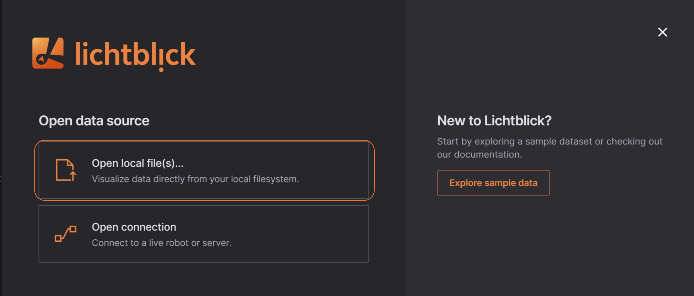

# PX 4

Load local PX 4 ULog (`ulg`) files for visualization.

# Local Data 

You can load local files for visualization by: 

* The "Open local file(s)..." in the initial pop up or the menu on the top left;
* You can drag'n drop the files from your OS file manager;

