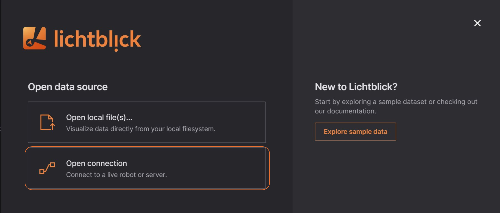

# ROS 2

Load local and remote [MCAP](../connecting-to-data/mcap.md) files containing ROS 2 data, or connect directly to a live ROS 2 stack.

## Live data

[Install ROS 2](https://wiki.ros.org/ROS/Installation), and make sure you're connected to the same network as the robot.

Then, in Lichtblick, select "Open connection", either on the initial welcome pop up or via the app bar menu.

### Live connections

You can use [Rosbridge](../connecting-to-data/rosbridge.md) or [Ros foxglove bridge](https://docs.foxglove.dev/docs/connecting-to-data/ros-foxglove-bridge) to establish a live connection between Lichtblick and ROS. This enables real-time data streaming, allowing you to interact with ROS topics, services, and parameters directly from Lichtblick.

## Local Data 

You can load local files for visualization by: 

* The "Open local file(s)..." in the initial pop up or the menu on the top left;
* You can drag'n drop the files from your OS file manager;

{{#include ../components/foxglove_note.md}}
