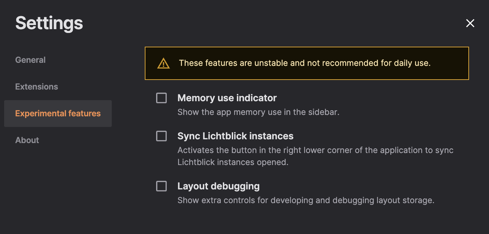

# Experimental Features

> ⚠️ **Experimental features are not guaranteed to be stable**  
> These features are made available for testing, evaluation, and feedback purposes.

## What Are Experimental Features?

Lichtblick occasionally introduces early-stage features marked as _experimental_. These are functional but not yet finalized, and they may:

- Be unstable or incomplete.
- Change significantly in future versions.
- Be removed if no longer relevant or viable.

They are disabled by default and can be manually activated by the user.

> Enabling these features helps the team validate ideas and receive valuable user feedback before they become officially supported.

## How to Enable Experimental Features

1. Open Lichtblick.
2. Go to **Settings > Visualization settings > Experimental features**.
3. Toggle on any experimental feature available.

Once enabled, the corresponding feature becomes available immediately in the user interface or workflow.

## Staying Updated

The list of experimental features is **dynamic**—it may change across releases.  
To stay informed about new features, updates, or deprecations, we recommend to check:

- **Release notes**
- **Documentation**
- **In-app announcements**

---

## Feedback Welcome

Have suggestions or found a bug in an experimental feature?  
Your feedback is essential to improve these early capabilities.

→ Please submit your thoughts via the [Lichtblick issue tracker](https://github.com/lichtblick-suite/lichtblick/issues) or contribute directly via pull request.
