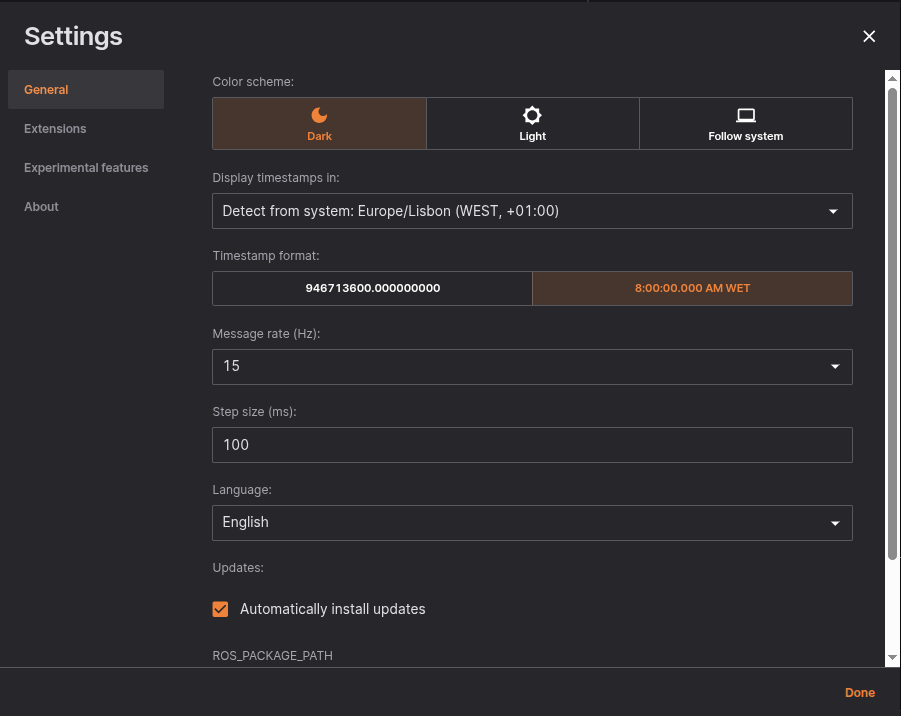

# Settings

### General

Here you can find the general settings that allows you to configure core preferences, such as language, appearance, and default behaviors. These settings help customize your experience to better fit your needs.

 

**Below is a list of all available options and their purposes:**

| Option | Description |
|--------|-------------|
| Color scheme | Allows the user to swith Lichtblick's appearance between light or dark mode, or to follow the user's OS settings |
| Time zone | Dropdown menu to select the time zone for displaying timestamps. |
| Timestamp format | Formatting options use to display timestamps (12-hour, seconds) |
| Message rate | Controls the update rate of the message pipeline. Lowering this can reduce CPU/GPU usage and power consumption while keeping the UI smooth at 60 FPS. |
| Step Size | Customize the default step size on the player (jump in time when clicking the arrow keys, [more info here](./visualization/shortcuts.md)). The default value is 100ms. |
| Language | Menu to select the app's language |
| Automatic updates | If selected allows the application to search and install updates (macOS and Windows only) |
| [ROS_PACKAGE_PATH](https://wiki.ros.org/ROS/EnvironmentVariables#ROS_PACKAGE_PATH) | Paths to search for ROS packages (local file paths or package:// URLs); separate paths with standard OS path separator (e.g. ':' on Unix).  |
| Advanced | Enables features to debugg the app |

### Extensions

The Extensions menu allows users to manage and install additional features to Lichtblick. Under the `LOCAL` section, you’ll find extensions that are already installed. The `DEFAULT` section lists available extensions that can be installed to enhance functionality.

 

Recently we added a search bar to the extensions menu to facilitate the experience when managing extensions.

 

When an extension is selected, a menu opens with options to install or uninstall the extension. This menu also allows users to view the extension's README and Changelog.

 

### Experimental features

The Experimental Features section includes early-stage functionalities that could be unstable and are not recommended for daily use. Options here allow users to test new capabilities, such as memory usage indicators, before they become part of the stable release. Use with caution, as these features may impact performance or cause unexpected behavior.

 

> * When the `Memory usage indicator` checkbox is selected, an indicator appears on the top bar showing the percentage of memory in use. Hovering over the indicator displays the actual memory usage in MB.

 

### About

This section provides information about the software version and legal details. Here, you can check the current version and access the license terms

