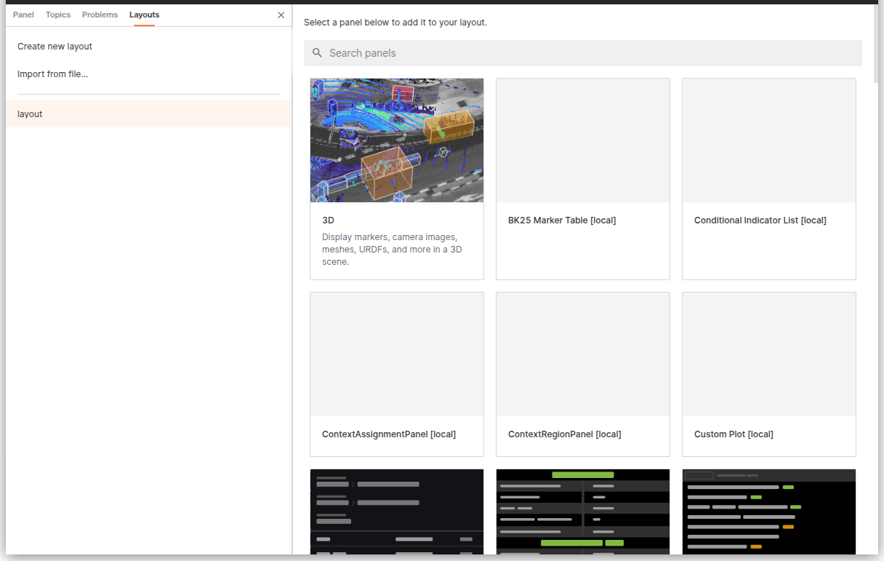

# Layouts 

Lichtblick layouts enable users to design and save customized workspaces tailored to specific tasks or workflows. These layouts can be reused for recurring projects or shared with team members working on similar challenges.

## Use Cases for Layouts

Layouts are highly versatile and can be adapted to various engineering and development scenarios. For instance:

- **Perception Engineers**: Create layouts for sensor calibration tasks.
- **Planning Engineers**: Design layouts to visualize and analyze routing algorithm outputs.
- **Controls Engineers**: Configure layouts to monitor and debug robot kinematics.

The **Layouts** menu provides all the tools needed to create, modify, and share layouts, ensuring a streamlined workflow.

## Layouts Menu Overview

### Personal Layouts

Personal layouts are exclusive to your account and cannot be accessed or modified by others. When signed in, these layouts are synchronized across all your devices, ensuring consistency. Additionally, personal layouts can be shared with your organization if required.

---

### Creating a Layout

To create a new custom workspace:

1. Navigate to the **Layouts** menu.
2. Select **Create new layout**.

#### Customization Options:
- **Add and arrange panels**: Organize panels to suit your workflow.
- **Adjust panel settings**: Configure individual panel properties.
- **Configure playback settings**: Tailor playback behavior for your data.
- **Set and manage variable values**: Define and control variables within the layout.

---

### Editing Layouts

When switching layouts after making changes to your current workspace, you will be prompted with the following options:

- **Save changes**: Save your modifications to the layout.
- **Revert**: Discard changes and restore the last saved version.

---

### Importing and Exporting Layouts

#### Exporting a Layout
To export a layout as a JSON file:

1. Open the layout’s context menu.
2. Select **Export...**.

Alternatively, you can access this option through the **View** submenu in the app menu (**Export layout to file...**).

#### Importing a Layout
To import a previously exported layout:

1. Navigate to the **Layouts** menu.
2. Select **Import from file...**.

This option is also available in the **View** submenu in the app menu (**Import layout from file...**).

---

### Sharing Layouts

To share a personal layout with your organization:

1. Open the layout’s context menu.
2. Select **Share with team...**.

---

### Additional Layout Actions

Each layout includes a **Details** menu, which provides options to:

- **Rename**: Change the layout’s name.
- **Duplicate**: Create a copy of the layout.
- **Delete**: Remove the layout permanently.

#### Batch Actions
To perform actions on multiple layouts simultaneously:

- Use **Cmd** (Mac) or **Ctrl** (Windows/Linux) to select multiple individual layouts.
- Use **Shift** to select a contiguous range of layouts.
- Right-click any selected layout and use the context menu to apply batch actions.

---

By leveraging Lichtblick's layout features, you can create efficient, reusable workspaces tailored to your specific needs, enhancing productivity and collaboration.