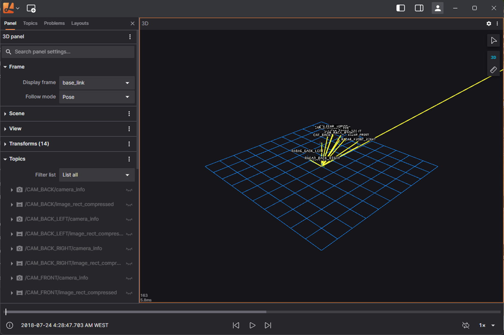
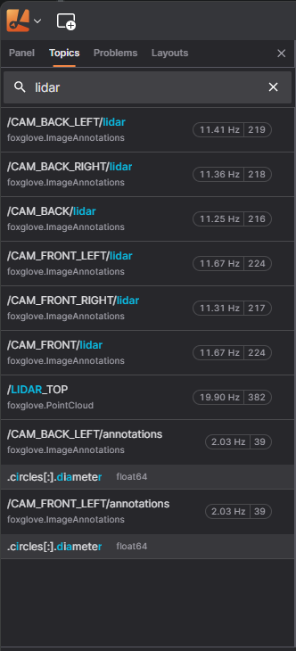

# Panels

## Overview
Panels in Lichtblick are flexible, modular elements that allow you to visualize and interact with data. You can customize and organize these panels within your layout.
To add a panel, use the "Add Panel" menu to select a new panel, or drag and drop the panel directly into your layout. 

Once added, you can easily move panels around by dragging their top bar.

Each panel's top bar has quick access to:
* **Menu** (represented by 3 dots) for common actions like panel splitting or changing the panel type
* **Settings** accessed through the cog icon to adjust the panel's configuration

### Customizing Panels
To edit a panel, click on the cog icon on its top bar to open the settings in the left sidebar. Each pael will be highlighted with the orange border when selected.

The sidebar allows you to filter the topics from your data source, and you can drang and drop topic results into panels for quick visualization. 

Topics can be mapped to specific panel types like:
* Raw messages and table panel for detailed message views
* Image panel for visual topics
* Plot and State Transiton panel for mesage path with graph-related data.

For selecting multiple message paths, hold `shift` for a range, or `Ctrl` (or `Cmd` on macOS) for multiple non-adjacent items.