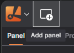

# Introduction

Lichtblick offers a comprehensive suite of visualization tools to help you analyze and interpret your robotics data effectively.

## Getting Started

To begin visualizing your data, connect to a data source and open a panel.

#### Open Data Source:
* Click "Open data source" in the left-hand menu.
* Choose from available options: live data or local file.

#### Opening a Panel:
* Click "Add panel" in the dashboard or left-hand menu.
* Select the desired panel type (e.g., 3D, Raw Message, Image).

## Desktop-only features

Connecting to data
* open a native ROS 1 connection
* connect to a Velodyne LIDAR hardware
* load local URDF and mesh resources in your 3D panel using package:// prefixed in the URLs

Extensions
* Install via registry
* Install locally 

## Interface Overview

Lichtblick's interface is designed for intuitive navigation:

**App Menu**: Connect to a data source, toggle sidebars, or access resources. 
**Add Panel**: Add a new panel to your current layout. 
**Layout Menu**: Save your workspace view as a layout and share it with teammates. 
**Left Sidebar**: Edit panel settings, view data source topics, and troubleshoot connection issues. 
**Right Sidebar**: Set layout-wide variables, view playback metrics. 

## Sidebars

#### Panel sidebar
Edit settings for any selected panel

#### Topics sidebar
View all topics available in the data source, along with their data types and message rates

#### Problems sidebar
See a list of playback errors to troubleshoot

#### Variables sidebar
set layout-wide variables that can be used in different panels with the message path syntax

## System Requirements

Lichtblick supports Windows, macOS, and Linux on both web and desktop platforms.

For the web application, use Chrome v111 or later.

For the desktop application, download the latest version for your operating system - check our latest release.

# Playback

When visualizing local or remote data files, you can navigate their contents using the playback controls.

## Message Ordering

Lichtblick orders and plays messages based on their log time. Log time typically refers to when the message was recorded but can be set to the timestamp that best reflects the reality you wish to visualize for time-critical signals. It's important to choose your log times carefully and consider sources of time skew such as network latency, batching, and buffering.

Robotics data is often associated with other timestamps, in addition to the log time. The Plot and State Transitions panels can be configured to order data using alternative timestamp fields:

|Timestamp Source|Description|
|----------------|-----------|
|Header stamp|A `header.stamp` field within the message data containing `sec` and `nsec` integers.|
|Publish time|An optional MCAP-specific field|

## Message Loading

Lichtblick optimizes how it loads complex robotics data for more streamlined seeking and playback.

#### Message "lookback"
When seeking to an arbitrary point in your loaded data, it's unlikely that every topic you are visualizing has a message at exactly the time you jumped to. To ensure that your layout still displays reasonable data, Lichtblick performs a "lookback" on your data. It looks for the most recent message on each subscribed topic, ensuring that even when seeking to an arbitrary point, Lichtblick will still display reasonable data for all the panels in your layout.

#### Latched Topics
By default, ROS 1 .bag files, MCAP files, and Lichtblick data streams will play back using message latching. When seeking within your data, Lichtblick fetches the last message on all subscribed topics, even if they occurred multiple minutes before your seek location. Every panel in the layout will then automatically display the last data it saw for that topic, even if that data is infrequently published or was not published at that exact moment in time. Message latching allows panels to accurately display data from infrequently published topics, even while seeking around to multiple points in your data at random.

#### Preloading
While most Lichtblick panels display just the most recent message for a given topic, others like the Plot and Map panels benefit from visualizing messages across the data's entire time range. Preloading data allows these panels to access all their historical data throughout playback, making it easier to spot anomalies, summarize robot behavior, and recognize trends and patterns.

Even panels that visualize their most recently seen data can benefit from preloading. For example, the 3D panel preloads its transform messages to accurately position its markers. Robots often have many coordinate frames (e.g., joints of a robot arm, cameras on a self-driving car), each with their own markers. To render markers from different frames in a single 3D scene, the panel needs to use transforms to calculate the position of these visual elements in a common coordinate space. Since transforms accumulate and update over time, preloading ensures that the 3D panel has access to all necessary transform data for accurate visualization.

## Shortcuts

`Space` - pause or play 
`shift` + ⬅️ - seek backward 10ms  
`shift` + ➡️ - seek forward 10 ms  
⬅️ - seek backward 100ms  
➡️ - seek forward 100ms  
`Alt` + ⬅️ - seek backward 500ms  
`Alt` + ➡️ - seek forward 500ms

# Message schemas

## Introduction
Lichtblick requires incoming messages to conform to specific structures for proper visualization. Utilizing schemas allows you to fully leverage the platform's built-in visualizations.

#### Supported Formats
* Protobuf
* JSON schema
* ROS 1
* ROS 2
* TypeScript
* FlatBuffers

If you've already developed custom messages, you can transform them into Lichtblick-supported schemas using a message converter extension.

# **WIP**

## Protobuf and JSON schema

--------------------------------
-------------------------------
---------------------------------
-------------------------------

# Layouts

# Panels

## Overview
Panels in Lichtblick are flexible, modular elements that allow you to visualize and interact with data. You can customize and organize these panels within your layout.
To add a panel, use the "Add Panel" menu to select a new panel, or drag and drop the panel directly into your layout. 

Once added, you can easily move panels around by dragging their top bar.

Each panel's top bar has quick access to:
* **Menu** (represented by 3 dots) for common actions like panel splitting or changing the panel type
* **Settings** accessed through the cog icon to adjust the panel's configuration

### Customizing Panels
To edit a panel, click on the cog icon on its top bar to open the settings in the left sidebar. Each pael will be highlighted with the orange border when selected.

The sidebar allows you to filter the topics from your data source, and you can drang and drop topic results into panels for quick visualization. 

Topics can be mapped to specific panel types like:
* Raw messages and table panel for detailed message views
* Image panel for visual topics
* Plot and State Transiton panel for mesage path with graph-related data.

For selecting multiple message paths, hold `shift` for a range, or `Ctrl` (or `Cmd` on macOS) for multiple non-adjacent items.

# Variables

# Message path syntax

# Extensions

# Shareable links

# Open via CLI

# Shortcuts

# Annotate ROS enum fields

