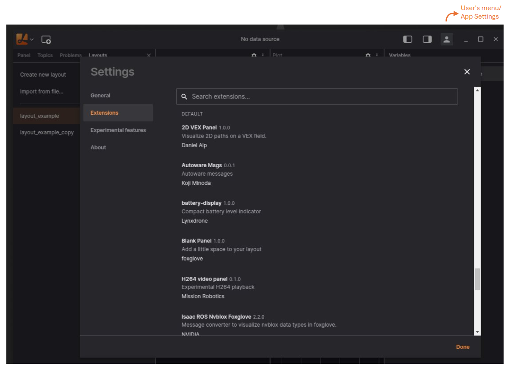

# Introduction

Lichtblick’s extensibility allows you to tailor the platform to your team’s unique workflows. By developing custom extensions, you can create specialized panels, convert custom message schemas into Lichtblick-supported formats, and alias topic names for seamless integration and visualization.

Once your extension is built and installed, you can manage it through the app settings, where all available and installed extensions are listed.



---

## Custom Panels

While Lichtblick offers a robust set of built-in panels for robotics data visualization and debugging, custom panel extensions enable you to create domain-specific solutions tailored to your needs. These panels can:

- Subscribe to messages from various topics.
- Publish data.
- Display information in a way that aligns with your workflow.

Custom panels are ideal when your visualization or interaction requirements go beyond the capabilities of the built-in panels.

**Example: Custom Panel**

```typescript
export function activate(extensionContext: ExtensionContext) {
  // Register a new panel
  extensionContext.registerPanel({
    name: "example-panel",
    initPanel: initExamplePanel,
  });
}
```

---

## Message Converters

Message converter extensions allow you to transform messages from one schema to another, making them compatible with Lichtblick’s built-in visualization tools. For example, you can convert custom GPS messages into `lichtblick.LocationFix` messages for visualization in the **Map** panel.

**Note**: Message converters run on-demand when a panel subscribes to a topic.

**Example: Message Converter**

```typescript
export function activate(extensionContext: ExtensionContext) {
  // Register a new message converter
  extensionContext.registerMessageConverter({
    fromSchemaName: "sensors.MyGps",
    toSchemaName: "lichtblick.LocationFix",
    converter: (inputMessage) => {
      // Logic to convert sensors.MyGps messages into lichtblick.LocationFix messages
    },
  });
}
```

---

## Topic Aliases

Topic alias extensions enable you to rename topics in your data source to new names. Lichtblick panels can subscribe to both the original and aliased topics, providing flexibility in how you organize and visualize your data.

**Example: Topic Aliases**
The `registerTopicAliases` function maps original topics to new names based on the current layout’s global variables. It automatically re-executes when the data source’s topics or global variables change.

```typescript
import { ExtensionContext } from "@lichtblick/extension";

export function activate(extensionContext: ExtensionContext): void {
  // Register a topic alias function
  extensionContext.registerTopicAliases((args) => {
    const { globalVariables } = args;
    // Use the current value of the `camera` global variable
    const camera = globalVariables["camera"] ?? "FRONT";
    return [
      {
        sourceTopicName: `/CAM_${camera}/image_rect_compressed`,
        name: `/selected_camera_image`,
      },
      { sourceTopicName: "/imu", name: "/aliased_imu" },
      { sourceTopicName: "/odom", name: "/aliased_odom" },
    ];
  });
}
```

---

## Writing an Extension

Extensions can be developed in JavaScript or TypeScript and packaged as `.foxe` files. These files can be shared privately within your organization or distributed publicly via the Lichtblick extension registry. The desktop app supports installing extensions directly from the registry. A single extension can include multiple panels, converters, or aliases.

Lichtblick provides starter templates and commands in the [create-lichtblick-extension](https://github.com/Lichtblick-Suite/create-lichtblick-extension) package to simplify the development process.

### Requirements:

- **Node.js 14+**

To set up an extension project, follow the instruction from the GitHub repository.

---

By leveraging Lichtblick’s extensibility, you can create powerful, customized solutions that enhance your team’s productivity and data visualization capabilities.
