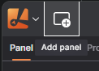
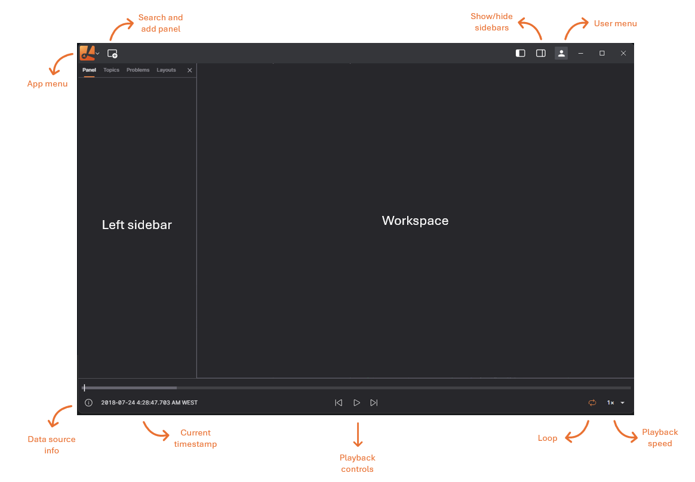

# Visualization

Lichtblick offers a comprehensive suite of visualization tools to help you analyze and interpret your robotics data effectively.

## Getting Started

To begin visualizing your data, connect to a data source and open a panel.

#### Open Data Source:

- Click "Open data source" in the left-hand menu.
- Choose from available options: live data or local file.

#### Opening a Panel:

- Click "Add panel" in the dashboard or left-hand menu.
- Select the desired panel type (e.g., 3D, Raw Message, Image).

## Desktop-only features

Connecting to data

- open a native ROS 1 connection
- connect to a Velodyne LIDAR hardware

Extensions

- Install via registry

## Interface Overview

Lichtblick's interface is designed for intuitive navigation:

**App Menu**: Connect to a data source, toggle sidebars, or access resources. 
**Users Menu**: Go to app settings, extensions catalog, experimental features, licenses, and version.  
**Add Panel**: Add a new panel to your current layout. 
**Layout Menu**: Save your workspace view as a layout and share it with teammates. 
**Left Sidebar**: Edit panel settings, view data source topics, and troubleshoot connection issues. 
**Right Sidebar**: Set layout-wide variables, view playback metrics. 

## Sidebars

#### Panel sidebar

Edit settings for any selected panel

#### Topics sidebar

View all topics available in the data source, along with their data types and message rates

#### Problems sidebar

See a list of playback errors to troubleshoot

#### Variables sidebar

Set layout-wide variables that can be used in different panels with the message path syntax

## System Requirements

Lichtblick supports Windows, macOS, and Linux on both web and desktop platforms.

For the web application, use Chrome v111 or later.

For the desktop application, download the latest version for your operating system - check our latest release here: [Lichtblick Releases](https://github.com/Lichtblick-Suite/lichtblick/releases)
