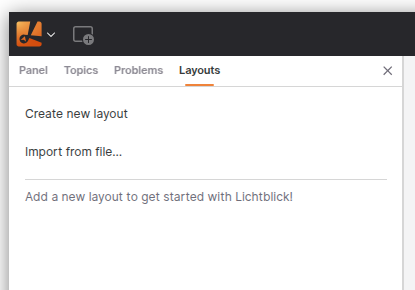
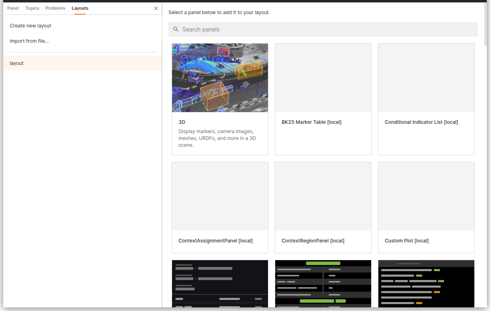
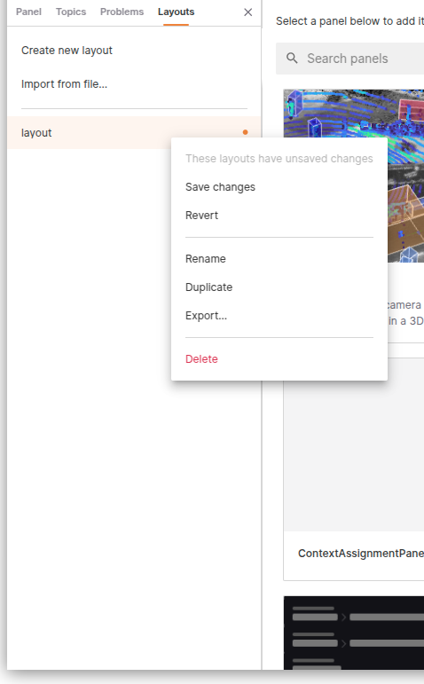

# Layouts

Lichtblick layouts enable users to design and save customized workspaces tailored to specific tasks or workflows. These layouts can be reused for recurring projects or shared with team members working on similar challenges.

## Use Cases for Layouts

Layouts are highly versatile and can be adapted to various engineering and development scenarios. For instance:

- **Perception Engineers**: Create layouts for sensor calibration tasks.
- **Planning Engineers**: Design layouts to visualize and analyze routing algorithm outputs.
- **Controls Engineers**: Configure layouts to monitor and debug robot kinematics.

The **Layouts** menu provides all the tools needed to create, modify, and share layouts, ensuring a streamlined workflow.



## Layouts Menu Overview

### Creating a Layout

To create a new custom workspace:

1. Navigate to the **Layouts** menu.
2. Select **Create new layout**.



#### Customization Options:

- **Add and arrange panels**: Organize panels to suit your workflow.
- **Adjust panel settings**: Configure individual panel properties.
- **Configure playback settings**: Tailor playback behavior for your data.
- **Set and manage variable values**: Define and control variables within the layout.

---

### Editing Layouts

When switching layouts after making changes to your current workspace, you will be prompted with the following options:

- **Save changes**: Save your modifications to the layout.
- **Revert**: Discard changes and restore the last saved version.



### Web Version Considerations

For users accessing Lichtblick via the web version, it’s important to note that layouts are stored in **IndexedDB**, a client-side NoSQL database. Since browser data, including IndexedDB, can be cleared during cache or history deletion, it is recommended to export and save your layouts as JSON files to prevent data loss.

To ensure your layouts are preserved:

1. Export your layout as a JSON file using the **Export...** option in the layout’s context menu.
2. Store the exported file securely for future use or re-import it as needed.

This practice ensures that your custom layouts remain accessible even if browser data is cleared.

---

### Importing and Exporting Layouts

#### Exporting a Layout

To export a layout as a JSON file:

1. Open the layout’s context menu.
2. Select **Export...**.

Alternatively, you can access this option through the **View** submenu in the app menu (**Export layout to file...**).

#### Importing a Layout

To import a previously exported layout:

1. Navigate to the **Layouts** menu.
2. Select **Import from file...**.

This option is also available in the **View** submenu in the app menu (**Import layout from file...**).

---

### Additional Layout Actions

Each layout includes a **Details** menu, which provides options to:

- **Rename**: Change the layout’s name.
- **Duplicate**: Create a copy of the layout.
- **Delete**: Remove the layout permanently.

#### Batch Actions

To perform actions on multiple layouts simultaneously:

- Use **Cmd** (Mac) or **Ctrl** (Windows/Linux) to select multiple individual layouts.
- Use **Shift** to select a contiguous range of layouts.
- Right-click any selected layout and use the context menu to apply batch actions.

### Open Lichtblick via CLI with a Layout Parameter

**Desktop only**

Once you have created and saved a layout, it can be referenced as a parameter when launching Litchblick via CLI.

{{#tabs}}
{{#tab name="Linux"}}

```bash
lichtblick --defaultLayout="layout_example"
```

{{#endtab}}
{{#tab name="MacOS"}}

```bash
/Applications/Lichtblick.app/Contents/MacOS/Lichtblick --defaultLayout="layout_example"
```

{{#endtab}}
{{#tab name="Windows"}}

```bash
C:\Users\<USER>\AppData\Local\Programs\lichtblick\Lichtblick.exe --defaultLayout="layout_example"
```

{{#endtab}}
{{#endtabs}}

---

# Automatically loading layouts from user directory

**Desktop only**

Lichtblick supports automatically importing layout files from a predefined user directory. This allows users to preload layouts on startup, making it easier to maintain a consistent workspace configuration across sessions or machines.

### How It Works

When Lichtblick starts, it checks the user directory for layout files with the .json extension. These must be valid Lichtblick layout files. If a layout from the directory is not already present in your saved layouts, it will be imported automatically.

#### This mechanism is particularly useful for scenarios where:

- Teams want to distribute a standard set of layouts.
- Users frequently open Lichtblick on different systems or in new environments.
- Layouts need to be preloaded when launching via CLI or automation scripts.

### Directory Path

| Platform      | Path                                          |
| ------------- | --------------------------------------------- |
| MacOS & Linux | ~/.lichtblick-suite/layouts                   |
| Windows       | C:\Users\\\<USER\>\\.lichtblick-suite\layouts |

\*You can navigate to these paths and place your exported .json layout files directly into the folder.

### Behavior and Characteristics

- Layout files are imported in alphabetical order.
- If no layout was previously selected, the first layout (by alphabetical order) will be automatically activated on startup.
- Layouts are identified by name:
  - If a layout already exists with the same name, it will not be re-imported.
  - If the layout is renamed, it will be treated as a new layout and imported again.
  - If you want to force an update to a layout, delete the existing one before restarting Lichtblick or rename the updated file.

This automatic import system ensures that your custom layouts can be effortlessly reused, even in fresh environments or shared workstations.

---

By leveraging Lichtblick's layout features, you can create efficient, reusable workspaces tailored to your specific needs, enhancing productivity and collaboration.
