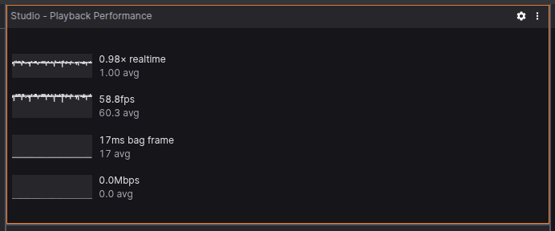

# Playback Performance Panel

## Overview

The PlaybackPerformance panel provides a real-time visualization of playback performance metrics during the execution of a playback session. It displays four primary metrics over a sliding time window:

- Playback Speed relative to real-time (× realtime)
- Frame Rate (fps)
- Bag Frame Duration (ms bag frame)
- Bandwidth Usage (Mbps)

These metrics are useful for diagnosing playback behavior and ensuring performance meets system expectations.

## Features

🔄 Real-time updates as playback state changes

📈 Sparkline graphs for each metric over the past 5 seconds

🧠 Smoothed display using averages to help detect trends

🎯 Compact and interactive UI, integrated with existing Suite UI components

## Metrics Explained

| Metric         | Description                                                 | Units        | Max Displayed Value |
| -------------- | ----------------------------------------------------------- | ------------ | ------------------- |
| `× realtime`   | Ratio of player time progression to wall-clock time         | multiplier   | 1.6                 |
| `fps`          | Approximate playback frame rate (based on render intervals) | frames/sec   | 30                  |
| `ms bag frame` | How much player time advanced in each render frame          | milliseconds | 300                 |
| `Mbps`         | Incoming data rate during playback                          | megabits/s   | 100                 |

----

**Note** that the *MaxDisplayedValue* only affects the vertical axis range of the sparkline, so values above 30 will still be calculated and shown, but they'll clip in the sparkline view. It does not limit the actual data values nor enforce any cap.
