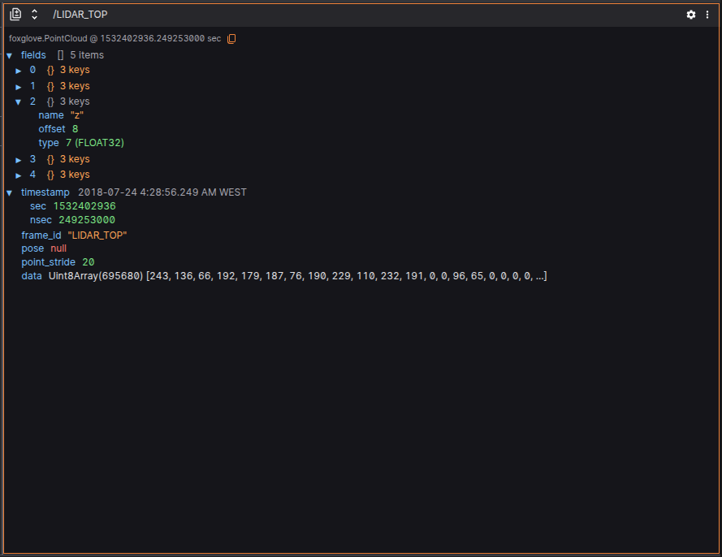
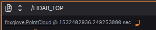
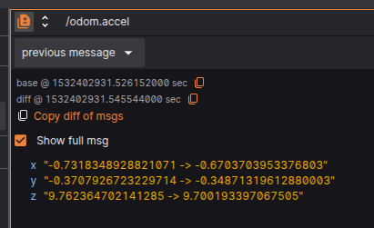
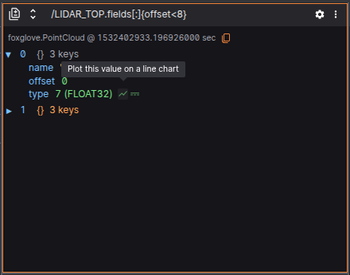
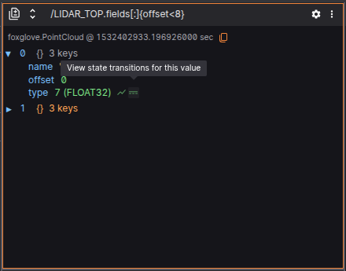
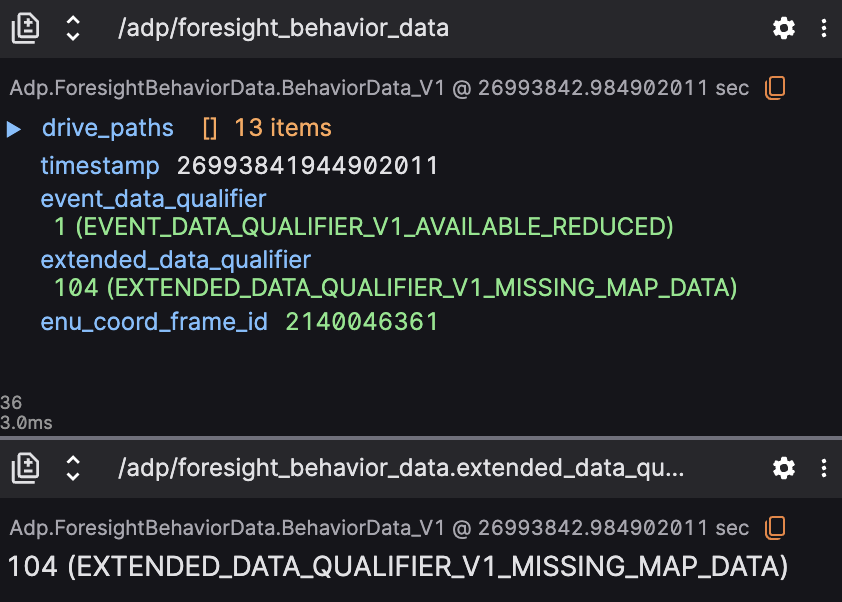

# Raw Messages

A panel that makes it simple to inspect message paths in the data source.

As new messages are received for a specific path, the panel tree will show just the last message. It's also possible to expand and collapse keys, and that will persist across playback

A link to documentation about the selected schema is available at the top.

## Settings 

| Field | Descripiton |
|----------|--------|
| Font size | Font size for text displayed on the panel |

## Controls and shortcuts

### Diff mode

Compares messages showing additions (green), deletions (red), and changes (yellow) to their fields across 2 categories:

- `previous message` - Compare the immediately previous message on the same message path;
- `custom` - Compare different topic messages in the same timestamp;

### Loading current data to other panels

Raw messages panel aslo provides an feature that allow users to open a specific message they're currently analyzing in [Plot](../panels/plot-panel.md) and [State Transitions]().

## Enum 

Raw Messages panel also shows additional information when a final topic is selected.

