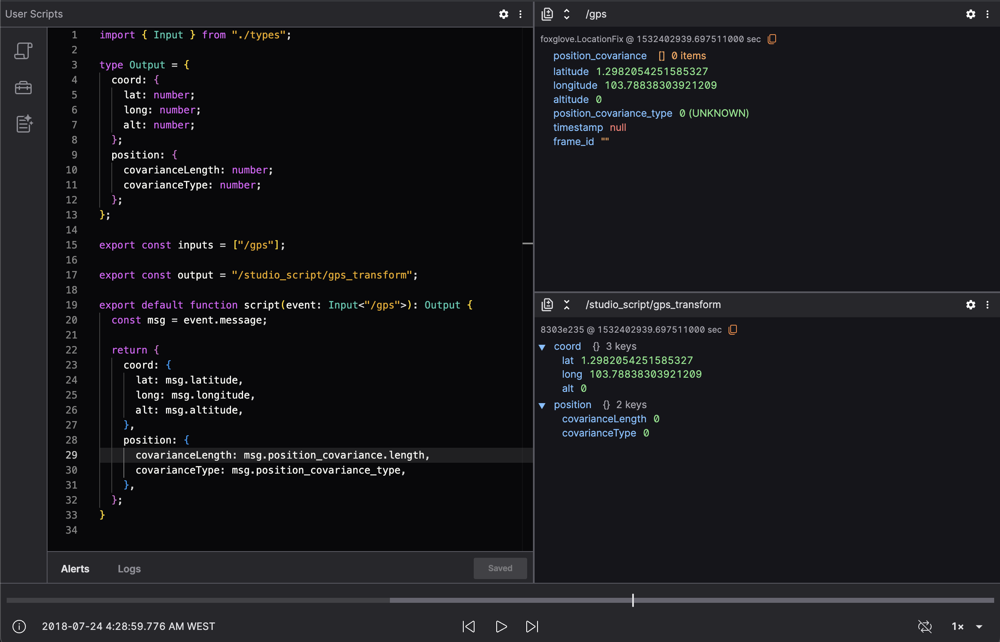
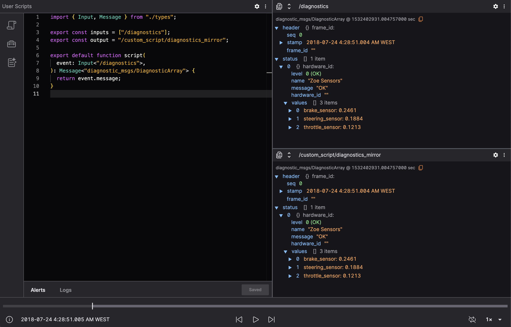
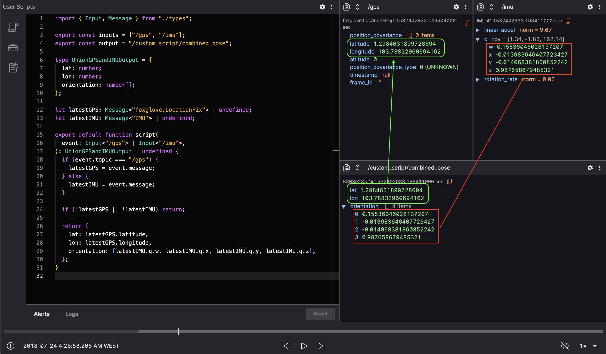
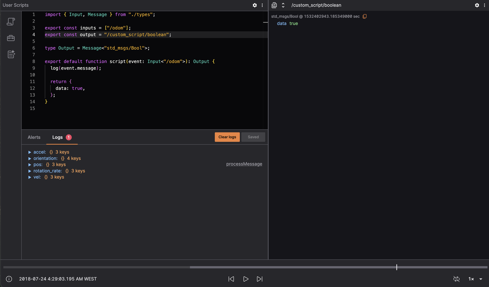
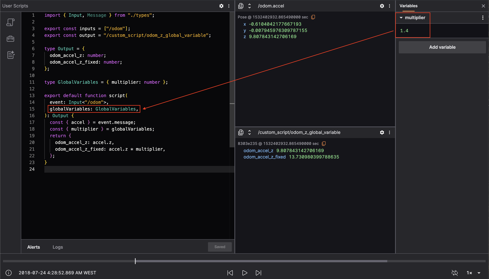

# User Scripts Panel

User Scripts enable you to create synthetic topics in Lichtblick by processing and reshaping existing messages. These scripts are especially useful for extracting insights, generating visualization-friendly data, or filtering out irrelevant noise from playback or full-range messages.

This chapter walks you through the process of writing and debugging your own scripts in TypeScript, with examples and tips to help you get started.

---

## What Are User Scripts?

User Scripts are custom functions written in TypeScript that run inside Lichtblick and allow you to:

- **Filter** messages (e.g., only show error logs).
- **Aggregate** values across multiple messages (e.g., average sensor readings).
- **Transform** messages into visualizations (e.g., markers or state transitions).
- **Synthesize** new topics from multiple inputs.

Scripts can process two types of data:

- **Playback messages** – Live, frame-by-frame data streamed into panels like _Raw Messages_ or _3D_.
- **Range-loaded messages** – Complete data over a playback range, used in panels like _Plots_ or _State Transitions_.



---

## How User Scripts Work

Each script requires three parts:

1. **Input topics** – Topics you want to consume.
2. **Output topic** – A synthetic topic where transformed messages are published.
3. **Script function** – The transformation logic.

Here’s a basic script that simply republishes every `/diagnostics` message under a new topic:

```ts
import { Input, Message } from "./types";

export const inputs = ["/diagnostics"];
export const output = "/custom_script/diagnostics_mirror";

export default function script(
  event: Input<"/diagnostics">
): Message<"diagnostic_msgs/DiagnosticArray"> {
  return event.message;
}
```



---

## Creating Your First Transformation

Let’s say you want to highlight high-temperature readings from a sensor topic. Here's how you could write that:

```ts
import { Input } from "./types";

type Output = {
  timestamp: number;
  temperatureC: number;
  alert: boolean;
};

export const inputs = ["/sensors/temperature"];
export const output = "/custom_script/high_temp_alerts";

export default function script(
  event: Input<"/sensors/temperature">
): Output | undefined {
  const { temperatureC, timestamp } = event.message;

  if (temperatureC < 70) return; // Don't publish normal readings

  return {
    timestamp,
    temperatureC,
    alert: true,
  };
}
```

This script suppresses normal messages and only publishes when temperatures are 70°C or higher.

---

## Using Multiple Input Topics

To combine data from different topics—say, GPS and IMU—you can use a union type:

```ts
import { Input, Message } from "./types";

export const inputs = ["/gps", "/imu"];
export const output = "/custom_script/combined_pose";

type UnionGPSandIMUOutput = {
  lat: number;
  lon: number;
  orientation: number[];
};

let latestGPS: Message<"foxglove.LocationFix"> | undefined;
let latestIMU: Message<"IMU"> | undefined;

export default function script(
  event: Input<"/gps"> | Input<"/imu">
): UnionGPSandIMUOutput | undefined {
  if (event.topic === "/gps") {
    latestGPS = event.message;
  } else {
    latestIMU = event.message;
  }

  if (!latestGPS || !latestIMU) return;

  return {
    lat: latestGPS.latitude,
    lon: latestGPS.longitude,
    orientation: [latestIMU.q.w, latestIMU.q.x, latestIMU.q.y, latestIMU.q.z],
  };
}
```



---

## Type Safety and Message Types

User Scripts are written in TypeScript for type safety. This ensures that your script matches the structure of each message and catches schema mistakes early.

You can use known ROS message types by wrapping them in the `Message<"type_name">` utility:

```ts
import { Input, Message } from "./types";

export default function script(
  event: Input<"/cmd_vel">
): Message<"geometry_msgs/Twist"> {
  return event.message;
}
```

If you're unsure of the message format, check the `types.ts` utility file in your script environment. This file is auto-generated and contains all known message types in your dataset.

---

## Skipping Messages

You can simply return `undefined` when a message shouldn't be published. This is useful for filtering:

```ts
export default function script(
  event: Input<"/status">
): { error: boolean } | undefined {
  if (event.message.status !== "ERROR") return;

  return { error: true };
}
```

---

## Logging for Debugging

Add `log(...)` calls in your script to inspect values during execution:

```ts
log(event.message.temperatureC, "Temperature received");

return {
  // your transformed output
};
```



Avoid logging functions or very frequent values in high-rate topics, as this can degrade performance.

---

## Using Global Variables

Global variables can be used across invocations of your script, allowing you to create very dinamyc scripts.
Those variables are placed as the second parameter of the script function and are read-only on user scripts.

```ts
import { Input, Message } from "./types";

export const inputs = ["/odom"];
export const output = "/custom_script/odom_z_global_variable";

type Output = {
  odom_accel_z: number;
  odom_accel_z_fixed: number;
};

type GlobalVariables = { multiplier: number };

export default function script(
  event: Input<"/odom">,
  globalVariables: GlobalVariables
): Output {
  const { accel } = event.message;
  const { multiplier } = globalVariables;
  return {
    odom_accel_z: accel.z,
    odom_accel_z_fixed: accel.z * multiplier,
  };
}
```



---

## Using @foxglove/schemas Types

Lichtblick enables to use a library of known types that can be imported directly for structured output. While Lichtblick is still migrating its secondary dependencies, Foxglove schemas can be used as following:

```ts
import { Input } from "./types";
import { Color, Pose } from "@foxglove/schemas";

export default function script(event: Input<"/pose">): {
  pose: Pose;
  color: Color;
} {
  return {
    pose: event.message.pose,
    color: { r: 0, g: 1, b: 0, a: 1 },
  };
}
```

---

## Useful Panels for Scripting

| Panel                 | Use case                                                   |
| --------------------- | ---------------------------------------------------------- |
| **Raw Messages**      | Inspect both input and script output messages in real time |
| **Plot**              | Visualize numeric values over time                         |
| **State Transitions** | Track message states and derived transitions               |
| **3D**                | Visualize position, orientation, and markers               |
